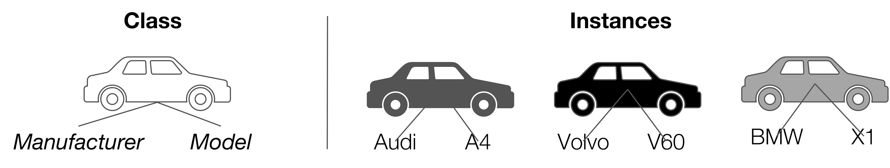
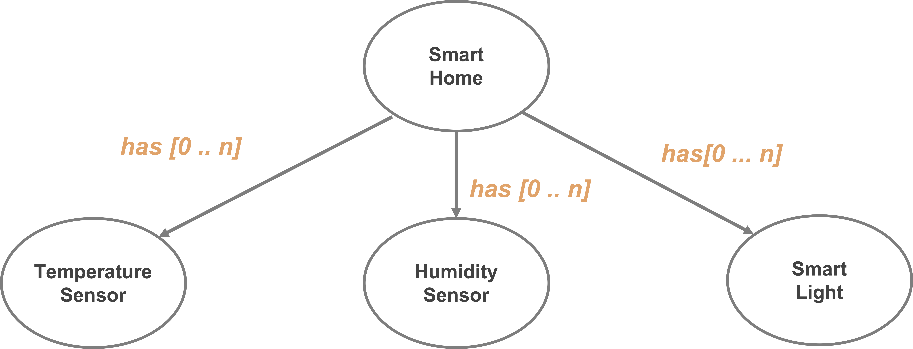
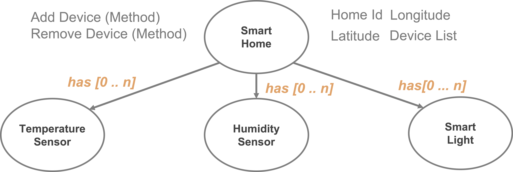
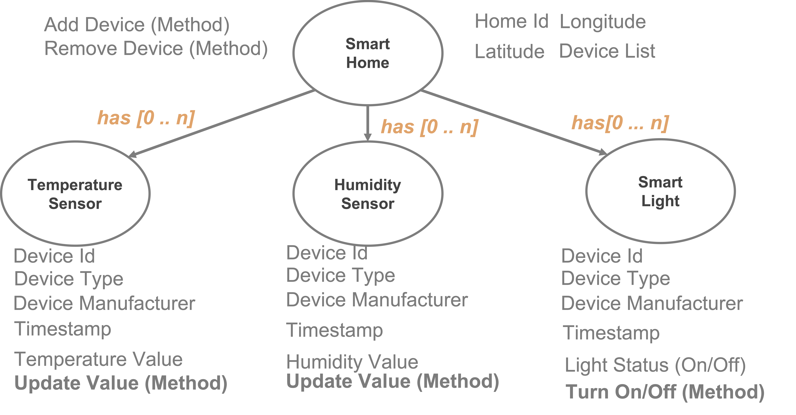
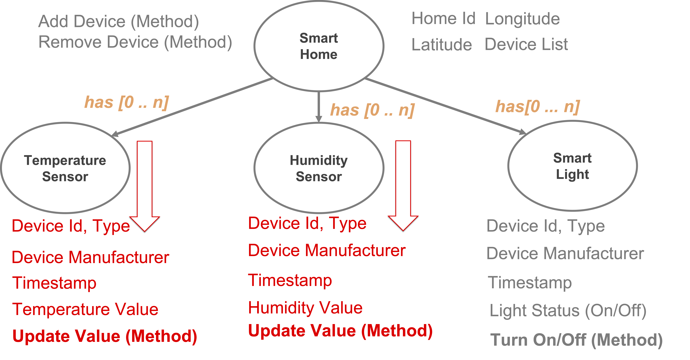
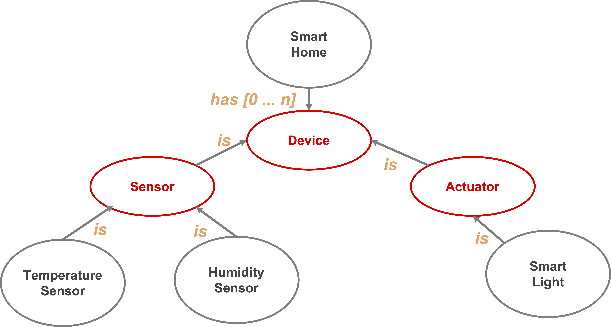
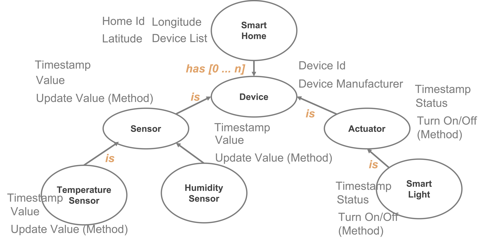
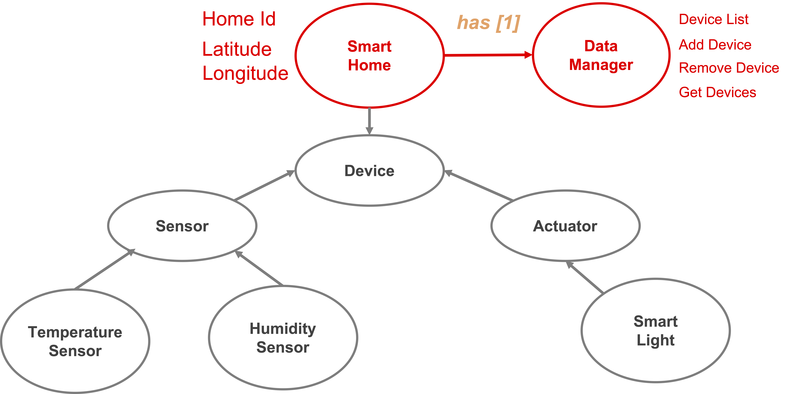

<!-- omit in toc -->
# Lecture 2 - Python Object Oriented Programming & Use Case Modelling

<!-- omit in toc -->
## Lecture Information

| **Master's Degree** | Intelligent Internet of Things (D.M.270/04)                                      |
|---------------------|----------------------------------------------------------------------------------|
| **Course**          | Intelligent Internet of Things                                                   |
| **Lecture Title**   | Python & Object-Oriented Programming (OOP)                                       |
| **Author**          | Prof. Marco Picone (marco.picone@unimore.it)                                     |
| **License**         | [Creative Commons Attribution 4.0](https://creativecommons.org/licenses/by/4.0/) | 


<!-- omit in toc -->
# Table of Contents

- [2.1 Object Oriented Programming (OOP) Introduction](#21-object-oriented-programming-oop-introduction)
  - [2.1.1 What Is Object-Oriented Programming ?](#211-what-is-object-oriented-programming-)
  - [2.1.2 How Was Object-Oriented Programming Born?](#212-how-was-object-oriented-programming-born)
  - [2.1.3 OOP Among Programming Paradigms](#213-oop-among-programming-paradigms)
  - [2.1.4 Procedural Programming vs. Object-Oriented Programming](#214-procedural-programming-vs-object-oriented-programming)
    - [2.1.4.1 Example: Procedural vs. Object-Oriented Approach](#2141-example-procedural-vs-object-oriented-approach)
    - [2.1.4.2 Key Points](#2142-key-points)
  - [2.1.5 Limitation of "Simple" Data Structures](#215-limitation-of-simple-data-structures)
  - [2.1.6 Classes, Objects and Interfaces](#216-classes-objects-and-interfaces)
  - [2.1.7 The Four Pillars of Object-Oriented Programming](#217-the-four-pillars-of-object-oriented-programming)
- [2.2 OOP & Python](#22-oop--python)
  - [2.2.1 Defining a Class in Python](#221-defining-a-class-in-python)
  - [2.2.2 The Constructor and Object Creation](#222-the-constructor-and-object-creation)
    - [2.2.2.1 The `__init__()` Method](#2221-the-__init__-method)
    - [2.2.2.2 Creating an Instance of a Class](#2222-creating-an-instance-of-a-class)
    - [2.2.2.3 Multiple Instances of the Same Class](#2223-multiple-instances-of-the-same-class)
    - [2.2.2.4 Understanding `self`](#2224-understanding-self)
  - [2.2.3 Instance Attributes](#223-instance-attributes)
    - [2.2.3.1 Adding Attributes to the `__init__()` Method](#2231-adding-attributes-to-the-__init__-method)
    - [2.2.3.2 Creating Instances with Attributes](#2232-creating-instances-with-attributes)
    - [2.2.3.3 Instances Without Parameters](#2233-instances-without-parameters)
    - [2.2.3.4 Access Instance Attributes](#2234-access-instance-attributes)
    - [2.2.3.5 Change Instance Attributes](#2235-change-instance-attributes)
  - [2.2.4 Instance Methods and Dunder Methods](#224-instance-methods-and-dunder-methods)
    - [2.2.4.1 Classes & Instance Methods](#2241-classes--instance-methods)
    - [2.2.4.2 Pythonic Class Print Method](#2242-pythonic-class-print-method)
    - [2.2.4.3 Pythonic Dunder Methods](#2243-pythonic-dunder-methods)
    - [2.2.4.4 Object Creation Internals: `__new__()` and `__init__()`](#2244-object-creation-internals-__new__-and-__init__)
    - [2.2.4.5 The Class Destructor `__del__()`](#2245-the-class-destructor-__del__)
  - [2.2.5 Class Attributes, Class Methods, and Static Methods](#225-class-attributes-class-methods-and-static-methods)
    - [2.2.5.1 Class Attributes](#2251-class-attributes)
    - [2.2.5.2 Class Methods](#2252-class-methods)
    - [2.2.5.3 Static Methods](#2253-static-methods)
  - [2.2.6 Encapsulation and Access Control](#226-encapsulation-and-access-control)
    - [2.2.6.1 Access Modifiers in Python](#2261-access-modifiers-in-python)
    - [2.2.6.2 Getters and Setters](#2262-getters-and-setters)
    - [2.2.6.3 The Pythonic Way: `@property`, `.setter`, and `.deleter`](#2263-the-pythonic-way-property-setter-and-deleter)
  - [2.2.7 Inheritance](#227-inheritance)
    - [2.2.7.1 Class Inheritance](#2271-class-inheritance)
    - [2.2.7.2 Method Overriding](#2272-method-overriding)
    - [2.2.7.3 Multilevel and Multiple Inheritance](#2273-multilevel-and-multiple-inheritance)
    - [2.2.7.4 Method Resolution Order (MRO)](#2274-method-resolution-order-mro)
  - [2.2.8 Polymorphism](#228-polymorphism)
    - [2.2.8.1 Duck Typing](#2281-duck-typing)
    - [2.2.8.2 Operator Polymorphism](#2282-operator-polymorphism)
    - [2.2.8.3 Class-Based Polymorphism](#2283-class-based-polymorphism)
    - [2.2.8.4 Polymorphism via Method Overriding](#2284-polymorphism-via-method-overriding)
    - [2.2.8.5 Method Overloading vs. Method Overriding](#2285-method-overloading-vs-method-overriding)
  - [2.2.9 Abstraction](#229-abstraction)
    - [2.2.9.1 Informal Interfaces](#2291-informal-interfaces)
    - [2.2.9.2 Formal Abstraction with `abc`](#2292-formal-abstraction-with-abc)
  - [2.2.10 Classes & Comments](#2210-classes--comments)
- [2.3 Exception Management](#23-exception-management)
  - [2.3.1 Exception Management in Python](#231-exception-management-in-python)
  - [2.3.2 Else & Finally](#232-else--finally)
  - [2.3.3 Custom Exceptions](#233-custom-exceptions)
- [2.4 Object Oriented Programming Smart Home Example (in Python)](#24-object-oriented-programming-smart-home-example-in-python)
  - [2.4.1 Which are the Entities in the Project ?](#241-which-are-the-entities-in-the-project-)
  - [2.4.2 Sensors & Actuators Characteristics](#242-sensors--actuators-characteristics)
  - [2.4.3 Open "Issues" and Model Improvements](#243-open-issues-and-model-improvements)
  - [2.4.4 Updated Modeling with Inheritance - Device Class](#244-updated-modeling-with-inheritance---device-class)
  - [2.4.5 Updated Modeling with Inheritance - Sensor Class](#245-updated-modeling-with-inheritance---sensor-class)
  - [2.4.6 Updated Modeling with Inheritance - Actuator Class](#246-updated-modeling-with-inheritance---actuator-class)
  - [2.4.7 From Sensor Abstraction to TemperatureSensor & HumiditySensor](#247-from-sensor-abstraction-to-temperaturesensor--humiditysensor)
  - [2.4.8 From Actuator Abstraction to SmartLight](#248-from-actuator-abstraction-to-smartlight)
  - [2.4.9 Final Overall Design and Modeling with Inheritance](#249-final-overall-design-and-modeling-with-inheritance)
- [2.5 Smart Home and Data Manager](#25-smart-home-and-data-manager)
- [2.6 Implementing the Smart Home Class and its Behaviors](#26-implementing-the-smart-home-class-and-its-behaviors)
- [2.7 Design Patterns](#27-design-patterns)
  - [2.7.1 What Are Design Patterns?](#271-what-are-design-patterns)
  - [2.7.2 Classification: Creational, Structural, Behavioral](#272-classification-creational-structural-behavioral)
  - [2.7.3 The Delegation Principle in Our Smart Home Example](#273-the-delegation-principle-in-our-smart-home-example)
  - [2.7.4 Singleton Pattern](#274-singleton-pattern)
  - [2.7.5 Factory Pattern](#275-factory-pattern)
  - [2.7.6 Observer Pattern](#276-observer-pattern)

# 2.1 Object Oriented Programming (OOP) Introduction

## 2.1.1 What Is Object-Oriented Programming ?

**Object-Oriented Programming (OOP)** is a powerful programming paradigm that organizes software design around data, or **objects**, rather than functions and logic. OOP enables developers to model real-world entities and their interactions, making code more modular, reusable, and easier to maintain. 

**Key Points of OOP:**

- **Objects:**  
  - Represent real-world entities (e.g., a person, a car, an email).
  - Bundle together **properties** (attributes/data) and **behaviors** (methods/functions).
- **Properties (Attributes):**  
  - Define the characteristics of an object.  
    - *Example (Person):* `name`, `age`, `address`
    - *Example (Email):* `recipient_list`, `subject`, `body`
- **Behaviors (Methods):**  
  - Define what an object can do or how it interacts.  
    - *Example (Person):* `walk()`, `talk()`, `breathe()`, `run()`
    - *Example (Email):* `add_attachment()`, `send()`
- **Encapsulation:**  
  - Combines data and methods that operate on that data within a single unit (object).
  - Helps protect the internal state of an object from unintended interference.
- **Abstraction:**  
  - Hides complex implementation details and exposes only the necessary features of an object.
- **Inheritance:**  
  - Allows new classes (objects) to acquire the properties and behaviors of existing ones, promoting code reuse.
- **Polymorphism:**  
  - Enables objects to be treated as instances of their parent class rather than their actual class, allowing for flexible and interchangeable code.

**Why Use OOP?**

- Encourages **modular** and **organized** code structure.
- Facilitates **code reuse** through inheritance and composition.
- Makes it easier to **maintain** and **extend** software systems.
- Models complex systems more naturally by mirroring real-world relationships.

> **Objective:**  
> This course will introduce you to the fundamental tools and design principles of OOP, empowering you to structure your code effectively and laying the groundwork for deeper exploration of advanced object-oriented concepts in the future.

---

## 2.1.2 How Was Object-Oriented Programming Born?

Object-oriented programming did not appear all at once: it emerged gradually, starting in the 1960s and 1970s.

- **Simula (1967)** is generally considered the first language to introduce the concepts of **objects** and **classes**, originally designed to support complex simulations.
- **Smalltalk (1972)** later refined and popularized the paradigm, establishing many of the ideas — objects, message passing, classes — still used today.
- The paradigm then spread widely with the rise of languages such as **C++**, **Java**, and, more recently, **Python**.

The underlying motivation has always been the same: bring software closer to how humans naturally reason about the world — as a **collection of objects, each with its own state and behavior** — rather than as a sequence of instructions operating on separate data.

> **Note:** This is a short historical note meant to give context; it is not an exhaustive history of programming languages.

---

## 2.1.3 OOP Among Programming Paradigms

Object-Oriented Programming is **one paradigm among several**. A paradigm is simply a general *style* of writing code — a way of thinking about a problem before turning it into instructions. Different paradigms make different kinds of problems easier to think about, which is why more than one exists.

- **Imperative paradigm:** you tell the computer *exactly what steps to perform, in order*, to reach a result — like following a recipe ("crack the eggs, beat them, add sugar, mix, bake for 20 minutes"). Almost all the code you will write in this course, including Python OOP code, is imperative: you give explicit, ordered instructions, and the computer executes them one after another.
  ```python
  # Imperative: explicit steps to compute the total price
  total = 0
  for price in [10, 20, 30]:
      total = total + price
  print(total)
  ```
- **Declarative paradigm:** instead of listing steps, you describe *what result you want*, and something else figures out how to get there. `HTML` — a **markup language**, not a general-purpose programming language — is a good everyday example: you write `<b>bold text</b>` to say "this text should be bold," without writing any instructions for *how* the browser should draw it. Automation tools such as `Ansible` or `Docker Compose` — configuration tools, not programming languages either — work the same way: you describe the desired end state (e.g., "this server must have this package installed"), not the sequence of steps to reach it.
- **Functional paradigm:** organizes code around the evaluation of functions, favoring **pure functions** (same input always gives the same output, with no side effects), **immutable data** (values that never change once created), and **composing** small functions together instead of changing shared state.
- **Object-Oriented paradigm:** organizes code around objects that bundle data and behavior together — the subject of this lecture.

> **Note on Python:** every example in this lecture is written in Python's native style, which is **imperative and object-oriented**. Python has no declarative mode comparable to HTML or Ansible — those were mentioned above only to illustrate what "declarative" looks like, not because Python offers an equivalent. Python does borrow a couple of small ideas from the functional paradigm (e.g., `lambda`, `map()`, `filter()`), but that is a minor, optional part of the language and is not covered in this lecture.

---

## 2.1.4 Procedural Programming vs. Object-Oriented Programming

Object-oriented programming (OOP) is a programming paradigm that models both tangible real-world entities (like cars, sensors, or users) and abstract relationships (such as companies and employees, or students and teachers) as **software objects**. Each object encapsulates both **data** (attributes) and **behavior** (methods), allowing you to represent complex systems in a modular and intuitive way.

In contrast, **procedural programming** organizes code as a sequence of instructions or function calls, much like following a **recipe**: you define a set of steps that the program executes in order to accomplish a task. While this approach works well for simple or linear problems, it can become unwieldy as systems grow in complexity.

---

### 2.1.4.1 Example: Procedural vs. Object-Oriented Approach

**Procedural Programming Example:**

```python
# Representing a car using procedural programming
car_make = "Tesla"
car_model = "Model 3"
car_year = 2023

def start_car(make, model):
  print(f"{make} {model} is starting...")

start_car(car_make, car_model)
```

**Object-Oriented Programming Example:**

```python
# Representing a car using object-oriented programming
class Car:
  def __init__(self, make, model, year):
    self.make = make
    self.model = model
    self.year = year

  def start(self):
    print(f"{self.make} {self.model} is starting...")

my_car = Car("Tesla", "Model 3", 2023)
my_car.start()
```

---

### 2.1.4.2 Key Points

- **OOP models both data and behavior together** in objects, making code more modular and easier to maintain.
- **Procedural programming** separates data and functions, which can lead to less organized code as complexity increases.
- **Objects are central in OOP**: they represent both the structure (data) and the capabilities (methods) of entities in your program.
- **OOP mirrors real-world relationships**, making it easier to design and reason about complex systems.

**Fundamental Takeaways:**

- **Encapsulation:** Objects bundle data and behavior, hiding internal details.
- **Modularity:** Code is organized into reusable, self-contained objects.
- **Abstraction:** Complex systems are simplified by modeling only relevant features.
- **Reusability:** Objects and classes can be reused and extended, reducing duplication.
- **Maintainability:** Changes are easier to manage due to clear structure and separation of concerns.

By adopting OOP, you can build software that is more robust, flexible, and aligned with real-world concepts.

---

## 2.1.5 Limitation of "Simple" Data Structures

Traditional data types and data structures in Python—such as **numbers**, **strings**, and **lists**—are well-suited for representing simple pieces of information. For example, you might use a number to store the cost of an apple, a string for the name of a poem, or a list for your favorite colors.

However, when you need to represent **more complex entities**—such as IoT devices in a deployment—these basic structures quickly become limiting. Imagine you want to track several IoT devices, each with attributes like an **ID**, **manufacturer**, **software version**, **latitude**, and **longitude**.

A common but problematic approach is to use lists to store this information:

```python
temperature_sensor = ["device-0001", "acme-inc", "v1.0.0", 10.44121341, 44.2132112]
humidity_sensor = ["device-0002", "acme-inc", "v0.2-rc", 10.54121341, 44.3132112]
light_switch_actuator = ["device-0003", "acme-inc", "v0.1.1-rc", 10.64121341, 45.7132112]
```

While this method works for small examples, it introduces several **limitations**:

- **Lack of clarity:** It's not obvious what each element in the list represents without referring to documentation or comments.
- **Error-prone:** Mixing up the order of elements or forgetting an attribute can lead to subtle bugs.
- **Difficult to extend:** Adding new attributes (e.g., device status or last communication time) requires updating every list and all related code.
- **No behavior:** Lists can only store data; they cannot encapsulate behaviors or operations related to the device.

**Key Takeaways:**

- Basic data structures are insufficient for modeling complex, real-world entities.
- Lists and tuples lack explicit meaning for each attribute, making code harder to read and maintain.
- As complexity grows, maintaining and extending such representations becomes increasingly difficult.
- There is no way to associate behaviors (methods) with the data, limiting code organization and reusability.

> To effectively model complex entities like IoT devices, you need a way to group related data and behaviors together in a clear, maintainable, and extensible manner. This is where **Object-Oriented Programming (OOP)** becomes essential.

---

## 2.1.6 Classes, Objects and Interfaces



**Figure 2.1:** Simple representation of the relationship between Classes and Objects (Instances) for a `Car`.

**Classes** are fundamental building blocks in object-oriented programming. A **class** serves as a **blueprint** or **template** for creating user-defined data structures. It defines the **attributes** (data) and **methods** (behaviors) that characterize a particular type of object, but it does **not** hold any actual data itself.

- **Class:**  
  - Specifies what data (attributes) and behaviors (methods) an object should have.
  - Acts as a **blueprint**—it describes *how* something should be structured, but does not represent any specific item.

For example, a `Car` class might define that every car has a `manufacturer` and a `model`, and can perform actions like `start()` or `drive()`. However, the class itself does **not** represent any particular car.

- **Object (Instance):**  
  - An **object** (or **instance**) is a **concrete realization** of a class.
  - When you create an object from a class, you are building an **instance** that contains **actual data**.
  - Each instance has its own unique values for the attributes defined by the class.

For example, if `Car` is the class, then `my_car = Car("Audi", "A4")` creates an **instance** of the `Car` class. This instance represents a specific car with the manufacturer `"Audi"` and model `"A4"`.

- **Interface:**  
  - A generic, language-agnostic **contract**: a set of method signatures that a class agrees to provide, typically **without** supplying an implementation for them.
  - It specifies *what* a class must be able to do, not *how* it does it — complementary to a class, which specifies *how* an object is structured and behaves.
  - *Example:* a generic `Drivable` interface could require every implementing class to provide a `start()` and `stop()` method, without saying how each vehicle actually starts or stops internally.

**Key Points:**

- A **class** is a **template**; an **object** (or **instance**) is a **real, usable entity** created from that template.
- An **interface** is a contract of behavior, decoupled from any specific implementation.
- You can create multiple objects from the same class, each with different attribute values.
- Classes define **what** data and behaviors objects will have; objects hold the **actual data** and can perform the defined behaviors.

> **Note: Python and Interfaces, Compared to Other Languages**
>
> Languages like **Java** and **C#** have a dedicated `interface` keyword: a class explicitly declares `class Car implements Drivable`, and the **compiler** checks, before the program ever runs, that `Car` provides every method `Drivable` requires — if one is missing, the code simply does not compile. This is a strong, **compile-time guarantee**. It also lets a class honor several contracts at once even in a language that only allows inheriting from one parent class: in Java, a class can `implements` many interfaces while `extends` only one class.
>
> Python has **no such keyword, and no compiler check of this kind**: Python is dynamically typed, so nothing inspects a class before the program runs. Instead, Python relies on **duck typing** ("if it walks like a duck and quacks like a duck, it's a duck" — Section 2.2.8.1): any object that happens to have the right method can be used, regardless of which class it comes from or what it "declares" itself to be. If a method turns out to be missing, Python only tells you when that method is actually called, by raising an `AttributeError` — never in advance.
>
> Python offers three increasingly stronger ways to approximate an interface, all covered later in this lecture:
> 1. **Plain duck typing** — no explicit contract at all, just objects that happen to share a method name (Section 2.2.8.1 / 2.2.8.3).
> 2. **Informal interfaces** — a base class with placeholder methods that raise `NotImplementedError`, documenting the intended contract, but still only checked the moment a method is actually called (Section 2.2.9.1).
> 3. **`abc.ABC` + `@abstractmethod`** — the closest thing Python has to a real interface: it refuses to create an instance of an incomplete subclass at all (Section 2.2.9.2). This check still only happens once the program is running, never before — Python has no compile-time step where it could happen earlier.
>
> The underlying trade-off: languages with real interfaces catch a missing method **before the program ever runs**; Python catches it later, sometimes only when that exact line of code executes, in exchange for a lighter, more flexible style of OOP — the same "great experiment in freedom" already mentioned for access modifiers (Section 2.2.6.1).

---

## 2.1.7 The Four Pillars of Object-Oriented Programming

Independently of any specific language, the OOP paradigm rests on **four pillars**. They were already mentioned briefly in Section 2.1.1; here, each one gets its own language-agnostic definition and example, before Python's specific tools for realizing them are covered later in this lecture.

- **Encapsulation**
  - Bundles data and the methods that operate on it inside a single unit (the object), and controls access to that data through **visibility modifiers** (e.g., `public`, `private`, `protected`).
  - *Example:* a bank account's `balance` should only be modifiable through dedicated methods (e.g., `deposit()`, `withdraw()`), never by direct external assignment.
- **Inheritance**
  - Lets a new class be defined starting from an existing one, to **reuse** and **extend** its attributes and behaviors.
  - *Example:* an `ElectricCar` class can inherit from a general `Car` class, gaining its attributes and methods while adding or specializing others.
- **Polymorphism**
  - Lets components — objects, methods, or functions — exhibit **different behaviors** depending on the context or the specific type involved, while being used through a **common interface**.
  - *Example:* a `start_engine()` method can behave differently depending on whether it is called on an `ICECar` or on an `ElectricCar`, even though both are invoked the same way.
- **Abstraction**
  - Focuses on **identifying the essential aspects** of a concept, while **hiding the implementation details** that are not relevant to the caller.
  - *Example:* a `Car` object exposes attributes such as `brand` and `model` and a `start()` method, without exposing — or requiring the caller to know — how the engine actually works internally.

**Resulting benefits:** programs designed around these four pillars tend to gain:

- **Modularity** — the code is broken into independent, reusable objects.
- **Maintainability** — encapsulating state reduces the risk of side effects and unintended behavior.
- **Extensibility** — behavior can be refined over time, either by extending higher-level classes or by overriding specific methods.

> Each pillar has a dedicated, Python-specific section later in this lecture: Encapsulation (Section 2.2.6), Inheritance (Section 2.2.7), Polymorphism (Section 2.2.8), and Abstraction (Section 2.2.9).

---

# 2.2 OOP & Python

Having covered the generic, language-agnostic OOP theory in Section 2.1, this section brings every one of those concepts down to Python: class syntax, object construction, attributes, instance/class/static methods, and each of the four pillars (Encapsulation, Inheritance, Polymorphism, Abstraction) implemented with concrete Python code.

## 2.2.1 Defining a Class in Python

All **class definitions** in Python begin with the `class` keyword, followed by the **class name** (written in **CapitalizedWords** notation by convention) and a colon. Any code that is **indented** beneath the class definition becomes part of the class body.

Here's a simple example of a `Car` class:

```python
class Car:
  pass
```

- The body of the `Car` class contains only the `pass` statement for now just to illustrate the syntax of a class definition.
- `pass` acts as a **placeholder**, indicating where code will be added in the future. It allows the class to be defined without causing errors, even if it currently has no attributes or methods.

> **Note:**  
> By convention, Python class names use **CapitalizedWords** notation (also known as PascalCase or UpperCamelCase). For example, a class representing a generic sensor device should be named `SensorDevice`.

---

## 2.2.2 The Constructor and Object Creation

Now that the `class` syntax is in place, this section covers how Python constructs and initializes new objects: the `__init__()` method, how instances are created, what happens when multiple instances exist, and the role of `self`.

### 2.2.2.1 The `__init__()` Method

The `Car` class isn't very useful yet because it doesn't define any properties or behaviors. To make it more meaningful, we can add **attributes** such as `manufacturer` and `model` (keeping it simple for now).

These attributes are defined and initialized in a special method called `__init__()`. The `__init__()` method is known as the **constructor** and is automatically called whenever a new object (instance) of the class is created. It sets up the initial state of the object by assigning values to its properties.

**Key aspects of the `__init__()` method:**

- The first parameter of `__init__()` is always `self`, which refers to the instance being created.
- You can add additional parameters to `__init__()` to initialize object attributes.
- The `__init__()` method allows each object to have its own unique data.

**Example: Defining an empty `__init__()` method in the `Car` class**

```python
class Car:
  def __init__(self):
    pass  # Placeholder for future initialization code
```

> The `pass` statement is used here as a placeholder, indicating that the method doesn't do anything yet but will be expanded later.

---

### 2.2.2.2 Creating an Instance of a Class

To create an instance of a class, you simply call the class as if it were a function. This invokes the `__init__()` method and creates a new object.

```python
my_car = Car()
```

In this example, `my_car` is an instance of the `Car` class. 
The `__init__()` method is called automatically when the instance is created.

---

### 2.2.2.3 Multiple Instances of the Same Class

Let's see what happens when you create **multiple instances** of the same class:

```python
car_1 = Car()
car_2 = Car()

print(car_1)
print(car_2)
print(car_1 == car_2)
```

**Output:**
```
<__main__.Car object at 0x106702d30>
<__main__.Car object at 0x108702d40>
False
```

**Explanation:**

- `car_1` and `car_2` are two **separate objects** (instances) of the `Car` class.
- When you print each object, Python displays their **memory addresses**, showing that they occupy different locations in memory.
- Comparing `car_1 == car_2` returns **`False`** because, by default, two different instances are considered **not equal**, even if they are created from the same class and have the same (empty) content.

**Key Points:**

- **Each call to the class creates a new, independent object.**
- **Instances have unique memory addresses**—they are distinct entities in memory.
- **Default equality (`==`) checks if two variables refer to the same object, not if their contents are the same.**
- **Objects created from the same class can behave differently if their attributes are set differently.**

This demonstrates that **classes are blueprints**, and each time you instantiate a class, you get a new, unique object—even if no attributes have been set yet.

> **Note:** Dedicated methods can be implemented to customize how instances are compared for equality based on their attributes, but by default, they are compared by their identity (memory address). In Python, this can be achieved by overriding the `__eq__` method in the class definition. This method allows you to define custom logic for comparing two instances of the class based on their attributes rather than their memory addresses.

---

### 2.2.2.4 Understanding `self`

In Python, `self` is a conventional name used to refer to the instance of the class within its methods. It acts as a reference to the current object, allowing you to access its attributes and methods. 

When you define a method in a class, the first parameter must always be `self`, which represents the instance that the method is being called on. This allows you to differentiate between instance variables (attributes) and local variables within the method. Here's a breakdown of how `self` works:

- **Instance Reference:**  
  - `self` refers to the specific instance of the class that is being manipulated. It allows you to access and modify the instance's attributes and call its methods.
  - For example, in the `__init__()` method of the `Car` class, `self.manufacturer` refers to the `manufacturer` attribute of the specific `Car` instance being created.
  - When you create an instance of the class, Python automatically passes the instance as the first argument to the method, which is why you don't need to provide it explicitly when calling the method.

```python
class Car:
  def __init__(self, manufacturer, model):
    self.manufacturer = manufacturer  # 'self' refers to the instance being created
    self.model = model

my_car = Car("Toyota", "Corolla")  # 'my_car' is passed as 'self' to __init__()
```

---

## 2.2.3 Instance Attributes

Building on the constructor mechanics from Section 2.2.2, this section covers how attributes are added, populated, read, and updated on individual instances.

### 2.2.3.1 Adding Attributes to the `__init__()` Method

The `__init__()` method in a Python class acts as a constructor and is designed to initialize the attributes of each new object (instance) you create. By defining **parameters** in the `__init__()` method, you can **require that specific information be provided when an object is instantiated**. 

Inside the method, you assign these parameter values to instance attributes using the `self` keyword, which ensures that each object maintains its own unique data. This approach allows you to create flexible and reusable classes, where each instance can have different attribute values based on the arguments passed during creation. 

For example, by adding `manufacturer` and `model` as parameters to the `__init__()` method of the `Car` class, you ensure that every `Car` object is initialized with its own manufacturer and model information.

```python
class Car:
  def __init__(self, manufacturer, model):
    self.manufacturer = manufacturer
    self.model = model
```

**Key Aspects:**

- The `__init__()` method is the **constructor** of the class and is called automatically when a new `Car` object is created.
- The method's **signature** is indented by four spaces, and its **body** is indented by eight spaces. This indentation is crucial in Python to indicate code blocks and class/method structure.
- The first parameter, `self`, refers to the **instance** being created.
- Inside `__init__()`, attributes are defined using `self.attribute_name = value`. For example:
  - `self.manufacturer = manufacturer` creates an attribute `manufacturer` and assigns it the value passed to the constructor.
  - `self.model = model` creates an attribute `model` and assigns it the corresponding value.
- These attributes are **unique to each instance** of the class.

---

### 2.2.3.2 Creating Instances with Attributes

Now that we have defined the `Car` class with attributes, let's create instances of this class with specific values for `manufacturer` and `model`:

```python
car_1 = Car("Toyota", "Corolla")
car_2 = Car("Honda", "Civic")

print(car_1.manufacturer, car_1.model)
print(car_2.manufacturer, car_2.model)
```

**Output:**
```
Toyota Corolla
Honda Civic
```

**Explanation:**

- When creating `car_1`, we pass `"Toyota"` and `"Corolla"` as arguments, which are assigned to the `manufacturer` and `model` attributes, respectively.
- Similarly, `car_2` is created with its own `manufacturer` and `model`.
- Each instance maintains its own state, allowing us to access the specific values assigned during creation.
- As you can see the `self` is visible only inside the class methods, and it is not used when creating instances or accessing attributes from outside the class. You just pass the required arguments to the class constructor (in this case, `manufacturer` and `model`) without mentioning `self`.

---

### 2.2.3.3 Instances Without Parameters

In Python, you can create instances of a class without passing any parameters to the constructor. This is possible when the `__init__()` method is defined without any additional parameters (besides `self`). In such cases, the instance will be created with default values or uninitialized attributes. On the other hand, if the `__init__()` method requires parameters, you must provide those arguments when creating an instance.

```python
# Attempting to create a Car instance without required arguments
car_1 = Car()  # This will cause an error!
```

Output:

```
Traceback (most recent call last):
   File "<pyshell#6>", line 1, in <module>
     Car()
 TypeError: __init__() missing 2 required positional arguments: 'manufacturer' and 'model'
```

**Explanation:**

- The `Car` class requires two arguments (`manufacturer` and `model`) when creating a new instance.
- If you try to instantiate a `Car` without providing these arguments, Python raises a `TypeError` indicating that the required positional arguments are missing.
- Always ensure you supply all required arguments when calling the constructor of a class that defines them in its `__init__()` method.

> **Tip:**  
> If you want to allow creating instances without specifying all attributes, you can provide default values in the `__init__()` method parameters.

```python
class Car:
  def __init__(self, manufacturer="Unknown", model="Unknown"):
    self.manufacturer = manufacturer
    self.model = model
```

Now you can create instances without arguments

```python
car_1 = Car()  # Uses default values
car_2 = Car("Honda", "Civic")  # Provides specific values
```

---

### 2.2.3.4 Access Instance Attributes

After you create instances of the `Car` class, you can **access their attributes** using **dot notation**. This allows you to retrieve or modify the values stored in each object's attributes.

```python
car1 = Car("Audi", "A4")
print(f"Car 1 -> Manufacturer: {car1.manufacturer} Model: {car1.model}")
```

**Output:**

```
Car 1 -> Manufacturer: Audi Model: A4
```

Or for example you can save the attributes in variables

```python
car2 = Car("BMW", "X3")
manufacturer = car2.manufacturer
model = car2.model
print(f"Car 2 -> Manufacturer: {manufacturer} Model: {model}")
``` 

**Key Aspects:**

- **Dot notation** (`object.attribute`) is used to access or modify instance attributes.
- All instances of the `Car` class are **guaranteed to have the defined attributes** (e.g., `.manufacturer`, `.model`).
- You can **confidently use these attributes** in your code, knowing they will always be present and hold the values assigned during object creation.
- This approach **improves code reliability and readability** compared to using basic data structures like lists or dictionaries.

By organizing data with classes, you ensure that each object has a consistent structure, making your code more robust and maintainable.

---

### 2.2.3.5 Change Instance Attributes

Although instance attributes are **guaranteed to exist** after initialization, their values can be **changed dynamically** at any time. This flexibility allows you to update the state of an object as your program runs.

**Example: Modifying Instance Attributes**

```python
car1 = Car("Audi", "A4")
print(f"Car 1 -> Manufacturer: {car1.manufacturer} Model: {car1.model}")

# Change the model attribute
car1.model = "Q3"
print(f"Car 1 -> Manufacturer: {car1.manufacturer} Model: {car1.model}")
```

**Output:**
```
Car 1 -> Manufacturer: Audi Model: A4
Car 1 -> Manufacturer: Audi Model: Q3
```

In this example:

- We first create a `Car` object with the model `"A4"`.
- We then update the `model` attribute to `"Q3"` using dot notation.
- The change is immediately reflected when we print the object's attributes again.

**Key Aspects:**
- **Instance attributes can be modified at any time** after object creation.
- **Dot notation** (`object.attribute = new_value`) is used to update attribute values.
- **Each instance maintains its own state**—changing one object's attributes does not affect others.
- **Dynamic updates** allow objects to reflect changes in real-world scenarios (e.g., updating a car's model after an upgrade).

This ability to modify attributes is a core feature of object-oriented programming, enabling your objects to evolve and respond to changes throughout your program.

---

## 2.2.4 Instance Methods and Dunder Methods

### 2.2.4.1 Classes & Instance Methods

**Instance Methods** are functions defined within a class that operate on individual instances of that class. 
Like the `__init__()` constructor, the first parameter of every instance method is always `self`, which refers to the specific object the method is called on.

```python
class Car:

  def __init__(self, manufacturer, model):
    self.manufacturer = manufacturer
    self.model = model

  # Instance method returning a description of the car
  def description(self):
    return f"Manufacturer: {self.manufacturer} Model: {self.model}"
```

**Key Points:**
- **Instance methods** are called on objects (instances) of a class, not on the class itself.
- The `self` parameter allows the method to access and modify the instance's attributes.
- Instance methods can perform operations using the data stored in the object.
- You invoke an instance method using dot notation: `car1.description()`.
- Instance methods help encapsulate behavior that is specific to each object, making your code modular and organized.

---

### 2.2.4.2 Pythonic Class Print Method

The `__str__()` method in Python is a special instance method that defines how an object is represented as a string. By default, printing an instance of a class displays its memory address, which is not informative. Implementing the `__str__()` method allows you to customize the string output, making it more meaningful and user-friendly.

Replacing a custom `.description()` method with `__str__()` is considered more Pythonic, as it integrates seamlessly with built-in functions like `print()` and `str()`. This approach enhances code readability and usability, especially when debugging or logging object information.

You can change what gets printed by defining a special instance method called __str__():

```python
# Replace description with __str__() method
def __str__(self):
    return f"Manufacturer: {self.manufacturer} Model: {self.model}"
```

**Key Points:**
- **`__str__()`** gives a readable string for an object.
- **Overrides** the default memory address output for instances.
- **Preferred** over custom methods for string representation.
- **Enhances** code clarity and debugging.
- **Called automatically** by `print()` and `str()`.

---

### 2.2.4.3 Pythonic Dunder Methods

**Dunder Methods** (short for "double underscore methods") are special methods in Python that begin and end with double underscores, such as `__init__()` and `__str__()`. These methods are also known as **magic methods** or **special methods**. They allow you to customize the behavior of your classes and objects, enabling integration with Python's built-in functions and operators.

Dunder methods are automatically invoked by Python in specific situations. For example, `__init__()` is called when an object is created, while `__str__()` is called when you print an object or convert it to a string. There are many other dunder methods that let you define how your objects behave when compared, added, indexed, iterated over, or used in other common operations.

Mastering dunder methods is essential for advanced object-oriented programming in Python, as they provide powerful ways to make your classes behave more like built-in types and interact seamlessly with Python's language features.

For a comprehensive list and detailed documentation, refer to the [Python Data Model documentation](https://docs.python.org/3/reference/datamodel.html#basic-customization).

**Key Points:**
- **Dunder methods** start and end with double underscores (e.g., `__init__`, `__str__`).
- They **customize class behavior** for built-in operations and functions.
- Examples include **object creation** (`__init__`), **string representation** (`__str__`), **comparison** (`__eq__`), **addition** (`__add__`), and more.
- Dunder methods are **automatically called** by Python in specific contexts.
- Understanding and using dunder methods is **crucial for advanced OOP** and creating Pythonic, robust classes.

---

### 2.2.4.4 Object Creation Internals: `__new__()` and `__init__()`

So far, object creation has been described only through `__init__()`. In reality, Python performs object creation in **two steps**, using two different special methods:

- **`__new__(cls, ...)`**: responsible for **allocating** and **returning** a new (empty) instance of the class. It is called **first**.
- **`__init__(self, ...)`**: responsible for **initializing** the instance that `__new__()` has just created — this is the constructor already covered in Section 2.2.2.1. It is called **right after** `__new__()`, on the object it returned.

In most day-to-day Python code you will only need `__init__()` — `__new__()` uses a sensible default implementation inherited from `object`. Overriding `__new__()` becomes relevant in advanced scenarios, such as controlling how many instances of a class can exist (see the Singleton design pattern in Section 2.7.4) or working with immutable types.

```python
class Car:
  def __new__(cls, *args, **kwargs):
    print("Allocating a new Car instance")
    instance = super().__new__(cls)
    return instance

  def __init__(self, manufacturer, model):
    print("Initializing the Car instance")
    self.manufacturer = manufacturer
    self.model = model


my_car = Car("Audi", "A4")
```

**Output:**
```
Allocating a new Car instance
Initializing the Car instance
```

**Key Points:**
- `__new__()` is called **before** `__init__()`, and is responsible for creating and returning the instance.
- `__init__()` receives the instance created by `__new__()` as `self`, and initializes its attributes.
- In multilevel inheritance, `__new__()` and `__init__()` are looked up and can be chained across the hierarchy using `super()`, just like any other method.

---

### 2.2.4.5 The Class Destructor `__del__()`

Just as objects can be created, they can also be **destroyed**. The **destructor method**, `__del__()`, is called when the garbage collector removes an instance — typically once there are no more references to it, or when the program terminates while the object is still alive.

```python
class Car:
  def __init__(self, manufacturer, model):
    self.manufacturer = manufacturer
    self.model = model

  def __del__(self):
    print(f"{self.manufacturer} {self.model} destroyed!")


my_car = Car("Audi", "A4")
del my_car
```

**Output:**
```
Audi A4 destroyed!
```

`__del__()` is mainly useful for:
- **Releasing resources** the object was holding (e.g., closing files or network connections).
- **Debugging/logging**, to track exactly when an object is destroyed.

**Key Points:**
- `__del__()` is called by the garbage collector, **not** directly by your code — calling it manually only executes its body, it does not free the object's memory.
- Its execution timing is **not always predictable** in complex programs, since it depends on when the garbage collector determines there are no more references to the object — so it should not be relied upon for time-critical cleanup.

> **Note: What Is a Garbage Collector?**
>
> The **garbage collector** is a part of the Python runtime that automatically frees the memory used by objects that are no longer needed, so the developer does not have to do it manually. In practice, Python keeps track of how many references point to each object; when that count drops to zero (e.g., after `del my_car`, or when a variable goes out of scope), the object becomes unreachable and its memory is reclaimed — which is exactly the moment `__del__()` runs.
>
> This matters because **not every language works this way**. Languages such as C or C++ use **manual memory management**: the developer must explicitly allocate memory (e.g., `malloc()` in C) and free it (`free()`) when it is no longer needed. Forgetting to free memory causes a **memory leak** (the program slowly consumes more and more memory), while freeing it too early or twice can crash the program. A garbage collector removes this entire class of bugs by handling memory automatically — at the cost of some extra runtime overhead and, as noted above, less predictable timing. Besides Python, languages like Java, C#, and JavaScript also rely on a garbage collector.

---

## 2.2.5 Class Attributes, Class Methods, and Static Methods

Not every attribute or method needs to belong to a single instance. Python also supports attributes and methods that belong to the **class itself**, shared across all its instances — plus methods that belong to a class only for organizational reasons, without touching class or instance state at all.

### 2.2.5.1 Class Attributes

A **class attribute** is defined directly inside the class body, **outside** of `__init__()`. Unlike instance attributes, a class attribute is **shared** by every instance of the class — more generally, OOP calls these **static variables**.

```python
class Car:
  # Class attributes
  wheels = 4              # Shared value
  total_cars = 0           # Shared counter

  def __init__(self, manufacturer, model):
    self.manufacturer = manufacturer
    self.model = model
    Car.total_cars += 1


car_1 = Car("Toyota", "Corolla")
car_2 = Car("Honda", "Civic")

print(Car.wheels)        # 4
print(Car.total_cars)    # 2
```

Class attributes are useful for shared values, shared counters, common configuration, or utilities that do not depend on any particular instance. They are accessed through the class name (`Car.wheels`), though they remain readable from an instance too (`car_1.wheels`).

**Key Points:**
- Class attributes are declared **outside** `__init__()`, directly in the class body.
- They are **shared** across every instance of the class.
- Access them with `ClassName.attribute_name` (preferred) or `instance.attribute_name`.

---

### 2.2.5.2 Class Methods

A **class method** operates on the **class itself** rather than on a specific instance. To define one:
- Replace `self` with **`cls`** as the first parameter, referring to the class.
- Annotate the method with **`@classmethod`**.

```python
class Car:
  wheels = 4
  total_cars = 0

  def __init__(self, manufacturer, model):
    self.manufacturer = manufacturer
    self.model = model
    Car.total_cars += 1

  @classmethod
  def get_total_cars(cls):
    return cls.total_cars


car_1 = Car("Toyota", "Corolla")
car_2 = Car("Honda", "Civic")
print(Car.get_total_cars())   # 2
```

**Which variables can a class method operate on?**

A class method only ever receives `cls` — the class itself — never a specific instance. Because of this, it can only work with:

- **Class attributes** (e.g., `cls.wheels`, `cls.total_cars`): shared state that belongs to the class, not to any single object.
- **Other class methods or static methods** of the same class, called through `cls.method_name()`.
- **New instances of the class**, created and returned with `cls(...)` — a technique used to build **alternative constructors** (see the example below).

A class method **cannot** directly read or modify one specific object's instance attributes (e.g., `self.manufacturer`), simply because no particular instance is passed to it. If a class method genuinely needs to work with one instance's data, that instance must be passed in explicitly as a regular argument, just like to any other function.

**Example: an alternative constructor**

A class normally has a single entry point for creating instances: `__init__()`. Sometimes, though, it is convenient to also create an instance starting from a *different* kind of input — for example, a single formatted string instead of two separate arguments. A class method is the standard way to offer this second entry point: calling `cls(...)` inside it builds a new instance exactly as `Car(...)` would, but this way, if the class were later renamed, `cls(...)` would still correctly point to the new name — an ordinary function using `Car(...)` directly would not.

```python
class Car:
  def __init__(self, manufacturer, model):
    self.manufacturer = manufacturer
    self.model = model

  @classmethod
  def from_string(cls, car_string):
    # e.g. "Toyota-Corolla" -> Car("Toyota", "Corolla")
    manufacturer, model = car_string.split("-")
    return cls(manufacturer, model)


car = Car.from_string("Toyota-Corolla")
print(car.manufacturer, car.model)   # Toyota Corolla
```

`from_string()` still ends up calling `__init__()` internally — it just does some extra work first (parsing the string), then hands the result to `cls(...)`, offering a second, more convenient way to build a `Car`.

---

### 2.2.5.3 Static Methods

A **static method**, annotated with `@staticmethod`, does **not** access or modify class or instance state — it has neither `self` nor `cls` among its parameters. It is placed inside a class purely for organizational reasons, because it is logically related to it.

```python
class Car:
  @staticmethod
  def is_valid_manufacturer(name):
    return isinstance(name, str) and len(name) > 0


print(Car.is_valid_manufacturer("Toyota"))  # True
print(Car.is_valid_manufacturer(""))        # False
```

**Key Points:**
- **Class methods** (`@classmethod`, `cls`) act on the class and its shared state.
- **Static methods** (`@staticmethod`) act on neither the class nor an instance — they are utility functions grouped inside the class for organization.
- Both are called through the class name, e.g. `Car.get_total_cars()`, `Car.is_valid_manufacturer(...)`.

> [!NOTE] Python Decorators
>
> `@classmethod` and `@staticmethod` are examples of **decorators**: a tool that lets you extend or modify the behavior of a function or method without changing its source code. `@property`, covered in Section 2.2.6.3, is another decorator you will use frequently in Python OOP. More information [here](https://www.geeksforgeeks.org/python/decorators-in-python/).

**Let's See How It Works**

Putting `total_cars`, `get_total_cars()`, and `is_valid_manufacturer()` together in the same class:

```python
class Car:
  total_cars = 0

  def __init__(self, manufacturer, model):
    self.manufacturer = manufacturer
    self.model = model
    Car.total_cars += 1

  @classmethod
  def get_total_cars(cls):
    return cls.total_cars

  @staticmethod
  def is_valid_manufacturer(name):
    return isinstance(name, str) and len(name) > 0


car_1 = Car("Toyota", "Corolla")
car_2 = Car("Honda", "Civic")
car_3 = Car("Ford", "Focus")

print(Car.get_total_cars())
print(Car.is_valid_manufacturer("Toyota"))
print(Car.is_valid_manufacturer(""))
```

**Output:**
```
3
True
False
```

Every call to `Car(...)` runs `__init__()`, which increments the **shared** `total_cars` class attribute — so by the time `get_total_cars()` is called, it correctly reports `3`, even though it was never told about `car_1`, `car_2`, or `car_3` individually. `is_valid_manufacturer()`, in contrast, never touches `total_cars` or any instance: it is a self-contained check, grouped inside `Car` purely because it is logically related to it.

---

## 2.2.6 Encapsulation and Access Control

This section puts the **Encapsulation** pillar introduced generically in Section 2.1.7 into practice in Python.

### 2.2.6.1 Access Modifiers in Python

Since attributes and methods live inside an object, it becomes possible to **control access** to them. Three levels are commonly used, all supported by convention in Python:

- **Public**: accessible both inside and outside the class. No leading underscore: `manufacturer = "Toyota"`.
- **Protected**: intended for use only inside the class and its subclasses. One leading underscore: `_model = "Corolla"`.
- **Private**: intended for use only inside the class itself. Two leading underscores: `__engine_serial = "X123"`.

```python
class Car:
  def __init__(self, manufacturer, model, engine_serial):
    self.manufacturer = manufacturer           # Public
    self._model = model                        # Protected
    self.__engine_serial = engine_serial        # Private
```

> **Important:** in Python, access modifiers are **conventions**, not enforced restrictions. Nothing stops external code from reading or writing `car._model`, or even `car._Car__engine_serial` (the actual, "name-mangled" attribute name Python uses internally for double-underscore attributes). This is different from languages like Java, where the compiler rejects access to a private field from outside its class. Respecting these conventions is left entirely to the developer — one of the reasons Python is sometimes called "a great experiment in freedom."

### 2.2.6.2 Getters and Setters

To access a limited-access attribute from outside the class in a controlled way, OOP uses **getters** and **setters**: public methods that read or modify the value of a restricted attribute. In Python, a getter has limited value on its own, but a setter is genuinely useful, since it can **validate** the new value before accepting it.

```python
class Car:
  def __init__(self, manufacturer, model):
    self._manufacturer = manufacturer
    self._model = model

  def get_model(self):
    return self._model

  def set_model(self, model):
    if not model:
      raise ValueError("model cannot be empty")
    self._model = model


car = Car("Toyota", "Corolla")
car.set_model("Yaris")
print(car.get_model())    # Yaris

try:
  car.set_model("")
except ValueError as e:
  print(f"Rejected: {e}")
```

This approach works, but it changes how attributes are *used*: instead of `car.model`, callers now have to remember to use `car.get_model()`/`car.set_model(...)`. This is exactly the drawback Python's `@property` mechanism is designed to remove.

### 2.2.6.3 The Pythonic Way: `@property`, `.setter`, and `.deleter`

Python provides the `@property`, `@attribute_name.setter`, and `@attribute_name.deleter` decorators to keep the simple `object.attribute` syntax **while still running validation code behind the scenes**. When code reads `car.model`, Python transparently calls the method annotated with `@property`; when code writes `car.model = value`, Python calls the method annotated with `@model.setter`.

```python
class Car:
  def __init__(self, manufacturer, model):
    self.manufacturer = manufacturer
    self._model = model

  @property
  def model(self):
    return self._model

  @model.setter
  def model(self, value):
    if not value:
      raise ValueError("model cannot be empty")
    self._model = value

  @model.deleter
  def model(self):
    del self._model


car = Car("Toyota", "Corolla")
car.model = "Yaris"     # calls the setter
print(car.model)        # calls the getter -> Yaris

try:
  car.model = ""
except ValueError as e:
  print(f"Rejected: {e}")
```

**Key Points:**
- `@property` turns a method into a **read** access point for `object.attribute`.
- `@attribute_name.setter` turns a method into a **write** access point for `object.attribute = value`, letting you validate the new value.
- `@attribute_name.deleter` lets you customize what happens on `del object.attribute`.
- The calling code keeps using plain attribute syntax (`car.model`), unaware that a method — and its validation logic — is running behind it.

**Let's See How It Works**

Applying the same `@property`/`.setter` pattern to a new `license_plate` attribute, this time rejecting anything that isn't a 7-character string:

```python
class Car:
  def __init__(self, manufacturer, model, license_plate):
    self.manufacturer = manufacturer
    self.model = model
    self.license_plate = license_plate   # goes through the setter below

  @property
  def license_plate(self):
    return self._license_plate

  @license_plate.setter
  def license_plate(self, value):
    if not isinstance(value, str) or len(value) != 7:
      raise ValueError("license_plate must be a 7-character string")
    self._license_plate = value


car = Car("Toyota", "Corolla", "AB123CD")
print(car.license_plate)

try:
  car.license_plate = "X"
except ValueError as e:
  print(f"Rejected: {e}")
```

**Output:**
```
AB123CD
Rejected: license_plate must be a 7-character string
```

Notice that even `__init__()` goes through the setter: `self.license_plate = license_plate` on the very first line looks like a plain attribute assignment, but because `license_plate` is a `@property`, Python actually calls the `.setter` method underneath — so a `Car` can never be created with an invalid plate in the first place, not just modified into one later.

---

## 2.2.7 Inheritance

### 2.2.7.1 Class Inheritance

**Inheritance** is a fundamental concept in object-oriented programming that allows one class (the **child class**) to acquire the attributes and methods of another class (the **parent class**). This mechanism promotes **code reuse**, **modularity**, and **extensibility** by enabling you to build new classes based on existing ones.

When you create a child class, it automatically inherits all the properties and behaviors defined in its parent class. However, child classes are not limited to what they inherit—they can also **override** existing methods or **extend** the parent class by adding new attributes and methods that are unique to themselves. This flexibility allows you to customize and specialize behavior for different types of objects while maintaining a consistent structure.

For example, you might have a generic `Vehicle` class that defines common attributes like `manufacturer` and `model`, and methods such as `start()`. You can then create a `Car` class that inherits from `Vehicle`, gaining all its features, but also adding specific attributes (e.g., `number_of_doors`) or overriding methods to provide specialized behavior.

To inspect the type of an object and its relationship to classes, Python provides built-in functions:

- Use `type(object)` to determine the exact class of an object:
  ```python
  type(car)
  # Output: <class '__main__.Car'>
  ```

- Use `isinstance(object, ClassName)` to check if an object is an instance of a specific class (including parent or child classes):
  ```python
  isinstance(car1, Car)
  # Output: True
  ```
Before writing a child class, it helps to have the full **parent class** in view. Here is `Car`, gathering together the attributes and methods built up across Section 2.2 (`manufacturer`/`model` from 2.2.3, `__str__()` from 2.2.4.2), plus one new method, `estimate_air_pollution()`, that will become useful in a moment:

```python
class Car:
  def __init__(self, manufacturer, model):
    self.manufacturer = manufacturer
    self.model = model

  def __str__(self):
    return f"Manufacturer: {self.manufacturer} Model: {self.model}"

  def estimate_air_pollution(self, path_km_value):
    # This generic Car has no information about its engine/fuel type,
    # so it cannot produce a real estimate: -1 signals "not available".
    # Concrete subclasses are expected to override this with a real computation.
    return -1
```

Here's an improved example of class inheritance in Python, building an `ElectricCar` **child class** on top of this `Car` **parent class**:

```python
class ElectricCar(Car):
  """
  ElectricCar inherits from Car and adds electric-specific attributes.
  """
  def __init__(self, manufacturer, model, battery_capacity_kwh):
    # Initialize attributes from the parent Car class
    super().__init__(manufacturer, model)
    # Add new attributes specific to ElectricCar
    self.battery_capacity_kwh = battery_capacity_kwh
    self.battery_level = 100  # Battery level as a percentage
```

**Explanation:**
- `ElectricCar` inherits all attributes and methods from `Car` using `super()` — including `__str__()` and `estimate_air_pollution()`, even though `ElectricCar` does not mention either of them here.
- Adds new attributes: `battery_capacity_kwh` and `battery_level`, which `Car` does not have.
- The next section (2.2.7.2) picks up this exact `Car`/`ElectricCar` pair and shows `ElectricCar` **overriding** `__str__()` and `estimate_air_pollution()` — now that the `Car` versions of both are visible above, it will be clear exactly what is being replaced.

**Key Points:**
- **Inheritance** enables child classes to reuse and extend the functionality of parent classes.
- **Child classes** inherit all attributes and methods from their parent, but can also define their own or override inherited ones.
- **Code reuse** and **modularity** are enhanced by organizing related classes in hierarchies.
- Use **`type()`** to check the exact class of an object.
- Use **`isinstance()`** to verify if an object is an instance of a particular class or its subclasses.
- Inheritance supports the creation of flexible and maintainable software architectures.

---

### 2.2.7.2 Method Overriding

**Method overriding** is a core feature of object-oriented programming that allows a child class to provide a specific implementation for a method that is already defined in its parent class. This enables you to customize or extend the behavior of inherited methods to suit the needs of the child class.

To override a method, simply define a method in the child class with the **same name** and **signature** as the one in the parent class. When you call this method on an instance of the child class, Python will use the child class's version, effectively replacing the parent's implementation for that object.

Below is an *"improved"* example of the `ElectricCar` class, which inherits from the `Car` class and overrides several methods:

```python
import random

class ElectricCar(Car):
  def __init__(self, manufacturer, model, kwh):
    # Call the parent class constructor to initialize common attributes
    super().__init__(manufacturer, model)
    # Add new attributes specific to ElectricCar
    self.kwh = kwh
    self.battery_level = 100  # Battery level as a percentage

  # Override the __str__ method to provide a custom string representation
  def __str__(self):
    # Use the parent class's __str__ and add electric-specific info
    return f"{super().__str__()} - Kwh: {self.kwh}"

  # Override or add new methods specific to ElectricCar
  def estimate_air_pollution(self, path_km_value):
    # Electric cars produce zero direct air pollution
    return 0

  def measure_battery_level(self):
    # Simulate measuring the battery level with a random value
    self.battery_level = random.randint(10, 100)
    return self.battery_level
```

**Explanation — what is overridden, and what is new**

Comparing this `ElectricCar` against the `Car` class shown in Section 2.2.7.1 line by line:

- `__init__` is **overridden**: `Car.__init__` only sets `manufacturer`/`model`, while `ElectricCar.__init__` also sets `kwh` and `battery_level`. It still calls `super().__init__(manufacturer, model)` first, so the parent's own initialization logic runs unchanged rather than being duplicated.
- `__str__` is **overridden**: `Car.__str__` returns `"Manufacturer: ... Model: ..."`; `ElectricCar.__str__` calls `super().__str__()` to reuse that exact text, and appends `" - Kwh: ..."` to it.
- `estimate_air_pollution` is **overridden**: `Car.estimate_air_pollution` always returns `-1`, a sentinel value meaning "not available" (a generic `Car` has no idea what engine it has); `ElectricCar.estimate_air_pollution` replaces that entirely and **always returns `0`**, a real, meaningful value, regardless of `path_km_value` — no call to `super()` here, because there is nothing from the parent's placeholder worth reusing.
- `measure_battery_level` is **new**, not an override: `Car` has no such method at all, so this is simply an addition, specific to `ElectricCar`.

Instantiating one of each and calling the same methods on both makes the difference concrete:

```python
car = Car("Toyota", "Corolla")
ecar = ElectricCar("Tesla", "Model 3", 75)

print(car)                                # Manufacturer: Toyota Model: Corolla
print(car.estimate_air_pollution(100))    # -1  (Car does not know how to compute this)

print(ecar)                               # Manufacturer: Tesla Model: Model 3 - Kwh: 75
print(ecar.estimate_air_pollution(100))   # 0   (overridden: a real, meaningful value)
```

**Key Points**

- **Method overriding** allows child classes to customize or replace inherited behavior.
- Use **`super()`** to access parent class methods and avoid code duplication.
- Overridden methods in the child class take precedence when called on child class instances.
- Child classes can introduce **new attributes and methods** in addition to overriding existing ones.
- Overriding supports **polymorphism**, enabling flexible and extensible code design.

---

### 2.2.7.3 Multilevel and Multiple Inheritance

Python also supports inheriting from a class that is itself derived from another (**multilevel inheritance**), and inheriting from **more than one** class at the same time (**multiple inheritance**).

**Multilevel inheritance:**

```python
class Vehicle:
  pass

class Car(Vehicle):
  pass

class ElectricCar(Car):
  pass
```

**Multiple inheritance:**

```python
class Chargeable:
  pass

class Connected:
  pass

class SmartElectricCar(Chargeable, Connected):
  pass
```

In multiple inheritance, `SmartElectricCar` acquires the attributes and methods of **both** `Chargeable` and `Connected`.

---

### 2.2.7.4 Method Resolution Order (MRO)

Every class in Python ultimately derives from the built-in `object` class, the root of every Python object.

```python
print(issubclass(Car, object))                  # True
print(isinstance(Car("Audi", "A4"), object))    # True
```

When a name (an attribute or a method) is looked up on an instance involved in multiple inheritance, and more than one parent defines it, Python needs a deterministic rule to decide which one wins. This rule is the **Method Resolution Order (MRO)**: classes are searched **depth-first, left-to-right**, without visiting the same class twice.

```python
class Base1:
  def greet(self):
    return "hi!"

class Base2:
  def greet(self):
    return "hello!"

class MultiDerived(Base1, Base2):
  pass


m = MultiDerived()
print(m.greet())          # hi! -> Base1 is searched before Base2

print(MultiDerived.__mro__)
# (<class 'MultiDerived'>, <class 'Base1'>, <class 'Base2'>, <class 'object'>)

print(MultiDerived.mro())
# [<class 'MultiDerived'>, <class 'Base1'>, <class 'Base2'>, <class 'object'>]
```

**Key Points:**
- `MultiDerived.__mro__` (an attribute) and `MultiDerived.mro()` (a method) both expose the exact search order Python will follow.
- Because `Base1` is listed before `Base2` in `class MultiDerived(Base1, Base2)`, its `greet()` takes precedence.
- Inspecting the MRO is the reliable way to predict which implementation will run when multiple parent classes define a method with the same name.

**Let's See How It Works**

A minimal case with the same structure as `MultiDerived` above, but with a name conflict this time:

```python
class A:
  def who(self):
    return "A"

class B:
  def who(self):
    return "B"

class C(A, B):
  pass


print(C().who())
print(C.mro())
```

**Output:**
```
A
[<class 'C'>, <class 'A'>, <class 'B'>, <class 'object'>]
```

`C` does not define `who()` itself, so Python walks the MRO looking for it: `C` (not found) → `A` (found — stop here) → `B` is never even checked for `who()`. `C.mro()` confirms the exact order Python used: `A` comes right after `C`, simply because it was listed first in `class C(A, B)`.

---

## 2.2.8 Polymorphism

This section puts the **Polymorphism** pillar introduced generically in Section 2.1.7 into practice in Python, which offers several different forms of it.

### 2.2.8.1 Duck Typing

Python's built-in functions already exhibit a form of polymorphism: the same function call behaves appropriately depending on the type of the argument it receives, without any explicit type checking.

```python
print(len("Hello"))     # 5 -> string length
print(len([1, 2, 3]))   # 3 -> list length

print(max(1, 3, 2))         # 3
print(max("a", "z", "m"))   # z
```

> [!Tip] Duck Typing
>
> If it walks like a duck and quacks like a duck, then it's a duck: Python cares about **what an object can do**, not about its declared type.

### 2.2.8.2 Operator Polymorphism

Operators like `+` also behave differently depending on the type of their operands:

```python
print(5 + 10)                # 15           -> integer addition
print("Hello " + "World!")   # Hello World!  -> string concatenation
print([1, 2] + [3, 4])       # [1, 2, 3, 4]  -> list concatenation
```

### 2.2.8.3 Class-Based Polymorphism

Two classes that are **not related by inheritance** can implement a method with the same name and signature, and be used interchangeably through that shared method — as long as the caller only relies on the method being present.

```python
class Car:
  def __init__(self, manufacturer, model):
    self.manufacturer = manufacturer
    self.model = model

  def start(self):
    return f"{self.manufacturer} {self.model}: engine starting..."


class Motorcycle:
  # Note: Motorcycle does NOT inherit from Car - it simply exposes the same method name.
  def __init__(self, manufacturer, model):
    self.manufacturer = manufacturer
    self.model = model

  def start(self):
    return f"{self.manufacturer} {self.model}: kick-starting..."


vehicles = [Car("Toyota", "Corolla"), Motorcycle("Ducati", "Monster")]
for v in vehicles:
  print(v.start())
```

### 2.2.8.4 Polymorphism via Method Overriding

Overriding a method in a subclass, already covered in Section 2.2.7.2 (`ElectricCar` overriding `__str__()` and `estimate_air_pollution()`), is itself a form of polymorphism: the same method call (`car.__str__()`, or simply `print(car)`) produces a different result depending on the actual class of the object it is called on — `Car` or `ElectricCar` — even though both are accessed through the exact same interface.

### 2.2.8.5 Method Overloading vs. Method Overriding

- **Overriding**: redefining, in a subclass, a method already provided by a parent class, to get more specific behavior (Section 2.2.7.2).
- **Overloading**: defining, in the *same* class, several methods with the same name but different parameters, letting the call be resolved based on the arguments passed.

Unlike languages such as Java or C++, **Python does not natively support method overloading** — a later definition simply replaces an earlier one with the same name:

```python
def product(a, b):
  return a * b

def product(a, b, c):
  return a * b * c

# product(4, 5) -> TypeError: missing 1 required positional argument: 'c'
print(product(4, 5, 5))    # 100
```

To emulate overloading in Python, common strategies include:
- **`*args`/`**kwargs`**, dispatching manually based on how many/which arguments were passed.
- **Default parameter values** (e.g., `def add(a=None, b=None)`), checking which ones were actually provided.
- Third-party tools such as the `multipledispatch` package, for a closer match to true overloading (outside the scope of this lecture).

```python
def add(*args):
  total = args[0]
  for value in args[1:]:
    total = total + value
  return total


print(add(2, 3))                 # 5
print(add(2, 3, 4))               # 9
print(add("Hello, ", "World!"))   # Hello, World!
```

**Key Points:**
- Duck typing and operator polymorphism come **for free** from Python's dynamic typing.
- Class-based polymorphism works across **unrelated classes** that just happen to share a method name.
- Polymorphism via overriding works **within an inheritance hierarchy** (Section 2.2.7.2).
- Python has no native method overloading; `*args`/`**kwargs` or default values are the idiomatic replacements.

**Let's See How It Works**

A third, unrelated class — `HybridCar` — joining `Car` and `Motorcycle` in the same mixed list:

```python
class HybridCar:
  # Also independent of Car/Motorcycle - just another class with a start() method.
  def __init__(self, manufacturer, model):
    self.manufacturer = manufacturer
    self.model = model

  def start(self):
    return f"{self.manufacturer} {self.model}: starting in electric mode..."


vehicles = [
  Car("Toyota", "Corolla"),
  Motorcycle("Ducati", "Monster"),
  HybridCar("Toyota", "Prius"),
]
for v in vehicles:
  print(v.start())
```

**Output:**
```
Toyota Corolla: engine starting...
Ducati Monster: kick-starting...
Toyota Prius: starting in electric mode...
```

The `for` loop never checks what type `v` is — it just calls `v.start()` and trusts that whatever object it gets will respond correctly. `Car`, `Motorcycle`, and `HybridCar` share no common parent class at all; they only happen to agree on having a `start()` method. That agreement alone is enough for polymorphism to work.

---

## 2.2.9 Abstraction

This section puts the **Abstraction** pillar introduced generically in Section 2.1.7 into practice in Python, and formalizes the **Interface** concept introduced in Section 2.1.6.

### 2.2.9.1 Informal Interfaces

An **informal interface** is a class that declares methods meant to be overridden by subclasses, without Python enforcing that they actually are. A common technique is to give each placeholder method a body that raises `NotImplementedError`, so that forgetting to override it fails loudly rather than silently:

```python
class Vehicle:
  def start(self):
    raise NotImplementedError("Subclasses must implement start()")

  def stop(self):
    raise NotImplementedError("Subclasses must implement stop()")


class Car(Vehicle):
  def start(self):
    return "Car engine starting..."

  def stop(self):
    return "Car engine stopping..."


car = Car()
print(car.start())      # Car engine starting...

vehicle = Vehicle()
# vehicle.start() would raise NotImplementedError only when actually called
```

Informal interfaces work well for small projects with few developers, since they involve no run-time checking beyond what happens when a missing method is actually *called*: a subclass that forgets to override `start()` will only fail the first time `start()` is invoked, which can make debugging harder as a project grows.

> This is exactly the technique used later in this lecture for the `Sensor.update_value()` and `Actuator.invoke_action()` methods of the Smart Home case study (Section 2.4): both are informal interfaces, using `NotImplementedError` to force every concrete sensor/actuator subclass to provide its own implementation.

### 2.2.9.2 Formal Abstraction with `abc`

Python's `abc` module (Abstract Base Classes) provides a **formal** version of the same idea. A class inheriting from `ABC` and declaring methods with `@abstractmethod` cannot be instantiated directly until every abstract method has been overridden — the check happens **at instantiation time**, not only when the method is eventually called.

```python
from abc import ABC, abstractmethod

class Vehicle(ABC):
  @abstractmethod
  def start(self):
    pass

  @abstractmethod
  def stop(self):
    pass


class Car(Vehicle):
  def start(self):
    return "Car engine starting..."

  def stop(self):
    return "Car engine stopping..."


try:
  v = Vehicle()
except TypeError as e:
  print(f"Cannot instantiate: {e}")

car = Car()
print(car.start())
```

**Output:**
```
Cannot instantiate: Can't instantiate abstract class Vehicle without an implementation for abstract methods 'start', 'stop'
Car engine starting...
```

Compared to informal interfaces, `ABC` provides:
- **Explicit contracts**: the required methods are declared once, in one place.
- **Safe instantiation**: an incomplete subclass fails immediately, not only when the missing method happens to be called.
- **Better tooling support**: IDEs and static analyzers can recognize abstract classes and methods.

**Key Points:**
- Informal interfaces (`NotImplementedError`) rely on discipline and fail only when the placeholder method is actually called.
- `ABC` + `@abstractmethod` fail immediately, at instantiation time, and make the contract explicit.
- Both are ways of realizing the generic **Interface** concept from Section 2.1.6 in Python.

**Let's See How It Works**

The example above already shows `Vehicle` itself refusing to be instantiated. But what happens with a subclass that implements *some*, but not *all*, of the required abstract methods?

```python
class Motorcycle(Vehicle):
  def start(self):
    return "Motorcycle engine starting..."
  # stop() is NOT implemented


try:
  m = Motorcycle()
except TypeError as e:
  print(f"Cannot instantiate: {e}")
```

**Output:**
```
Cannot instantiate: Can't instantiate abstract class Motorcycle without an implementation for abstract method 'stop'
```

Even though `Motorcycle` did implement `start()`, Python still refuses to create an instance, because `stop()` — inherited as an abstract method from `Vehicle` — was never overridden. This is exactly the safety net informal interfaces (Section 2.2.9.1) do not provide: with `NotImplementedError`, a missing `stop()` would only be discovered the first time something actually called `motorcycle.stop()`, possibly much later and far from where the bug was introduced.

---

## 2.2.10 Classes & Comments

Proper commenting is **essential** for writing clear, maintainable, and professional Python code. Comments help you and others understand the logic, intent, and structure of your programs, making collaboration and future updates much easier.

In Python, there are two main ways to add comments:

**Single-Line Comments**

Single-line comments begin with the `#` symbol. Everything after `#` on the same line is ignored by the Python interpreter. Use single-line comments for brief explanations, clarifying complex code, or leaving notes for future reference.

```python
# Calculate the area of a circle
radius = 5
area = 3.14 * radius ** 2  # Area formula: πr²
```

**Multi-Line Docstrings**

A **docstring** is a string literal placed immediately after the definition of a function, method, class, or module. Docstrings are enclosed in triple quotes (`""" ... """` or `''' ... '''`) and are used to document the purpose, behavior, and usage of code blocks. Docstrings can be accessed programmatically via the `.__doc__` attribute and are essential for generating documentation.

```python
def calculate_area(radius):
  """
  Calculate the area of a circle given its radius.

  Parameters:
    radius (float): The radius of the circle.

  Returns:
    float: The calculated area.
  """
  return 3.14 * radius ** 2
```

Or for classes:

```python
class Car:
  """
  Represents a car with manufacturer and model attributes.

  Attributes:
    manufacturer (str): The name of the car manufacturer.
    model (str): The model of the car.
  """
  def __init__(self, manufacturer, model):
    self.manufacturer = manufacturer
    self.model = model
```

Class docstrings offer a concise summary of the class, describing its purpose, main attributes, and often including a usage example.  
Method docstrings give specific details about the method, explaining its functionality, input parameters, return values, and any exceptions it might raise.

**Key Points:**

- **Single-line comments** (`#`) are ideal for short notes and clarifications.
- **Docstrings** provide structured documentation for functions, classes, and modules.
- Well-written comments and docstrings improve **code readability**, **collaboration**, and **maintenance**.
- Docstrings are accessible via the `.__doc__` attribute and support automated documentation tools.
- Use comments to explain **why** something is done, not just **what** is done.

---

## 2.3 Exception Management

Exception management in Python is a crucial aspect of writing robust and reliable programs. It enables developers to **handle errors gracefully**, preventing unexpected crashes and allowing the program to recover or provide meaningful feedback to users. Exception handling is accomplished using **`try`-`except` blocks**, which catch and respond to exceptions that occur during code execution.

An **exception** is an event that interrupts the normal flow of a program's instructions. Unlike **syntax errors**, which prevent code from running at all, exceptions are raised by the Python interpreter when an error occurs while the program is running. When an exception is triggered, Python displays a message starting with `Traceback (most recent call last):`, indicating where the error occurred and what type of exception was raised.

**Common exception types include:**
- **ZeroDivisionError**: Raised when dividing by zero.
- **FileNotFoundError**: Raised when trying to access a file that does not exist.
- **ValueError**: Raised when a function receives an argument of the correct type but inappropriate value.
- **IndexError**: Raised when trying to access an index that is out of range in a sequence (like a list).
- **NotImplementedError**: Raised when an abstract method that should be implemented is not.

**Example: IndexError (List Index Out of Range)**

```python
numbers = [1, 2, 3]
print(numbers[5])  # Attempting to access an index that does not exist
```

**Output:**
```
Traceback (most recent call last):
  File "example.py", line 2, in <module>
    print(numbers[5])
IndexError: list index out of range
```

**Key Points:**
- **Exception management** prevents program crashes and enables error recovery.
- Use **`try`-`except` blocks** to catch and handle exceptions.
- **Exceptions** are runtime errors that disrupt normal program flow.
- **Syntax errors** stop code before execution; **exceptions** occur during execution.
- Python provides detailed **tracebacks** to help locate and diagnose errors.
- Handling exceptions improves **program reliability** and **user experience**.
- Always anticipate and manage possible exceptions in your code for better maintainability.

> **Note:** Exception are handled in a stack where if an exception is not caught in the current function, it propagates up to the caller function, and so on, until it is either caught or reaches the top level of the program, which will terminate the program if unhandled. Exception and errors are normal part of programming and should be expected and handled properly.

---

## 2.3.1 Exception Management in Python

Python uses **exception handling** to manage errors that occur during program execution, allowing your code to respond gracefully rather than crashing. The primary mechanism for this is the `try`-`except` block, which lets you specify code that might raise an exception and define how to handle different error types.

**Basic Structure**

```python
try:
  # Code that may raise an exception
except ExceptionType:
  # Code to handle the specific exception
```

You can also catch **all exceptions** by omitting the exception type, or handle **multiple exception types** using multiple `except` clauses.

**Example 1: Handling a Specific Exception**

```python
try:
  result = 10 / 0
except ZeroDivisionError:
  print("Error: Division by zero is not allowed.")
```

**Example 2: Catching All Exceptions (Generic Handler)**

```python
try:
  print(undefined_variable)
except:
  print("An unexpected error occurred.")
```

**Example 3: Multiple Exception Clauses**

```python
try:
  value = int("abc")
  print(10 / value)
except ValueError:
  print("Error: Could not convert string to integer.")
except ZeroDivisionError:
  print("Error: Division by zero.")
except Exception as e:
  print(f"Other error: {e}")
```

**Printing Error Messages**

To display the actual error message, you can use the `as` keyword to bind the exception to a variable:

```python
try:
  print(undefined_variable)
except NameError as error:
  print(f"NameError occurred: {error}")
```

**Key Points**

- **try-except** blocks allow you to handle errors and prevent program crashes.
- Catch **specific exceptions** for targeted error handling.
- Use a **generic except** clause to catch any exception (not recommended for production code).
- Multiple **except clauses** let you handle different error types separately.
- Use **exception variables** (e.g., `except Exception as e`) to print or log detailed error messages.
- Proper exception handling improves **program reliability** and **user experience**.

## 2.3.2 Else & Finally

Python's `try`, `except`, `else`, and `finally` blocks work together to provide flexible error handling and control flow.

- **`try` block**: Contains code that may raise an exception.
- **`except` block**: Handles exceptions if they occur in the `try` block.
- **`else` block**: Runs only if no exception was raised in the `try` block.
- **`finally` block**: Runs no matter what—whether an exception was raised or not.

**Example:**

```python
try:
  value = int("42")
  print("Conversion successful.")
except ValueError:
  print("Conversion failed.")
else:
  print("No errors occurred.")
finally:
  print("This always executes.")
```

**Output:**
```
Conversion successful.
No errors occurred.
This always executes.
```

If an exception occurs, the `except` block runs and the `else` block is skipped, but the `finally` block still executes:

```python
try:
  value = int("abc")  # Raises ValueError
  print("Conversion successful.")
except ValueError:
  print("Conversion failed.")
else:
  print("No errors occurred.")
finally:
  print("This always executes.")
```

**Output:**
```
Conversion failed.
This always executes.
```

**Summary:**
- Use `else` for code that should run only if no errors occurred.
- Use `finally` for cleanup actions that must run regardless of errors (e.g., closing files or releasing resources).
- The combination of these blocks makes your code robust and predictable.

---

## 2.3.3 Custom Exceptions

You can create your own custom exceptions in Python by defining a new class that inherits from the built-in `Exception` class. Custom exceptions are useful when you want to signal specific error conditions in your code that are not covered by standard exceptions.

**Example: Defining and Using a Custom Exception**

```python
class BatteryLowError(Exception):
  """Raised when the battery level is too low for operation."""
  def __init__(self, battery_level, message="Battery level is critically low!"):
    self.battery_level = battery_level
    self.message = message
    super().__init__(f"{message} (Level: {battery_level}%)")
```

Then you can raise this exception in your code when a specific condition is met:

```python
def operate_electric_car(battery_level):
  if battery_level < 20:
    raise BatteryLowError(battery_level)
  print("Car is operating normally.")
```

Then you can use the custom exception in a `try-except` block:

```python
try:
  operate_electric_car(15)
except BatteryLowError as error:
  print(f"Custom Exception Caught: {error}")
```

**Explanation:**
- A new exception class `BatteryLowError` is defined, inheriting from `Exception`.
- The custom exception can include extra information (like `battery_level`) and a custom message.
- In the function `operate_electric_car`, the exception is raised if the battery level is below a threshold.
- The exception is caught using a `try-except` block, and a descriptive error message is printed.

**Key Points:**
- Custom exceptions help make your error handling more descriptive and specific.
- Always inherit from `Exception` or one of its subclasses.
- You can add custom attributes and messages to your exception class.
- Use custom exceptions to signal and handle domain-specific errors in your applications.

---

## 2.4 Object Oriented Programming Smart Home Example (in Python)

The objective of this exercise is to **practically apply object-oriented programming (OOP)** principles to model a simplified **IoT system** using Python classes. You will learn how to design and implement software components that represent real-world entities in a **Smart Home** environment.

**Scenario Overview**

Imagine a Smart Home equipped with various **IoT devices**:
- **Temperature sensors**
- **Humidity sensors**
- **Smart lights**

The task is to:
- **Design data structures** and identify appropriate **classes** to represent these devices.
- **Implement Python classes** to model device attributes and behaviors.
- Create a **central system** (e.g., a `SmartHomeController` class) to **collect** and **manage data** from all devices.

**Key Concepts**

- Use **class** definitions to encapsulate device properties (e.g., `device_id`, `location`, `status`) and behaviors (e.g., `read_temperature()`, `switch_on()`).
- Model each device type (e.g., `TemperatureSensor`, `HumiditySensor`, `SmartLight`) as a separate **class**.
- The **central system** should aggregate device data and provide methods for monitoring and control.

**Exercise Scope**

- The scenario is **simplified**:  
  - No network communication between devices.
  - All components run **within the same process**.
- Focus on **splitting components** into logical classes and enabling their **interaction** via method calls.
- In future lectures, you will learn how to extend this architecture to support **networked communication** and distributed systems.

> **Goal:**  Gain hands-on experience with OOP by modelling a Smart Home IoT system, preparing you for more advanced topics in distributed IoT software architecture.

## 2.4.1 Which are the Entities in the Project ? 



**Figure 2.2:** Smart Home IoT System Entities that then will be mapped to classes.

When designing a **Smart Home IoT system** using object-oriented programming, it is essential to identify the **key entities**, their **attributes** (data), and **behaviors** (methods) that reflect real-world requirements.

In our scenario, the **Smart Home** acts as the central hub, managing all connected devices. It should encapsulate:

- **Attributes:**
  - **Home ID**: Unique identifier for the smart home.
  - **Location Data**: Such as **latitude** and **longitude**.
  - **Device List**: A collection of all devices (e.g., temperature sensors, humidity sensors, smart lights) installed in the home.

- **Behaviors (Methods):**
  - **Add Device**: Attach a new sensor or light to the home.
  - **Remove Device**: Detach an existing device from the home.
  - **List Devices**: Retrieve information about all connected devices.

By using **classes** to represent both the Smart Home and its devices, you achieve:

- **Encapsulation**: Group related data and behaviors together.
- **Modularity**: Each entity is self-contained and reusable.
- **Extensibility**: Easily add new device types or features.
- **Clear Relationships**: The Smart Home maintains a list of devices and provides methods to manage them.

This modeling approach mirrors real-world systems, making your code **organized**, **maintainable**, and **scalable** for future enhancements.



**Figure 2.3:** Specifications of the Smart Home Entities with their attributes and behaviors.

---

## 2.4.2 Sensors & Actuators Characteristics



**Figure 2.4:** Specifications of the Sensors & Actuators with their attributes and behaviors.

When modeling **Smart Home IoT devices** using object-oriented programming, it is crucial to identify the **core attributes** and **behaviors** for each entity. 
This ensures your classes accurately represent real-world devices and support extensibility.
In our scenario, we have three primary device types: **Temperature Sensor**, **Humidity Sensor**, and **Smart Light** (an actuator).
Each device type should be encapsulated in its own class with specific attributes and methods.

A **Temperature Sensor** class should encapsulate:

- **Attributes:**
  - **ID**: Unique identifier for the sensor.
  - **Type**: Specifies the kind of sensor (e.g., temperature).
  - **Manufacturer**: The company that produced the sensor.
  - **Last Measurement Timestamp**: The time when the last reading was taken.
  - **Last Measurement Value**: The most recent temperature value (e.g., `25°C`).
- **Behavior (Method):**
  - **Update Value**: Reads a new measurement from the sensor and updates both the value and timestamp.

A **Humidity Sensor** class should include:

- **Attributes:**
  - **ID**: Unique identifier for the sensor.
  - **Type**: Specifies the kind of sensor (e.g., humidity).
  - **Manufacturer**: The company that produced the sensor.
  - **Last Measurement Timestamp**: The time when the last humidity reading was taken.
  - **Last Measurement Value**: The most recent humidity value (e.g., `90%`).
- **Behavior (Method):**
  - **Update Value**: Reads a new humidity measurement and updates the value and timestamp.

A **Smart Light** class, representing an actuator, should model:

- **Attributes:**
  - **ID**: Unique identifier for the light.
  - **Type**: Specifies the device type (e.g., smart light).
  - **Manufacturer**: The company that produced the light.
  - **Last Value Update Timestamp**: The time when the light's status was last changed.
  - **Status**: Current state of the light (e.g., `ON` or `OFF`).
- **Behavior (Method):**
  - **Change Status**: Triggers a change in the light's status (e.g., switches between ON and OFF), updating the timestamp accordingly.

By defining these **attributes** and **methods** in your classes, you achieve **encapsulation** of device data and behavior, making your code **modular**, **maintainable**, and ready for future expansion (such as adding new device types or features).

---

## 2.4.3 Open "Issues" and Model Improvements



**Figure 2.5:** Sensors design issues due to replicated fields and methods.

When designing the **Temperature Sensor** and **Humidity Sensor** classes, you'll notice that they share **many common attributes**—such as `id`, `type`, `manufacturer`, `last_measurement_timestamp`, and `last_measurement_value`. They also both implement a **method** for updating their current sensor value (e.g., `update_value()`).

This repetition suggests an opportunity for **modeling improvement** using **inheritance** and **abstraction**. 
By creating a **generic Sensor base class** that encapsulates the shared attributes and behaviors, you can:

- **Reduce code duplication** by defining common fields and methods only once.
- **Increase maintainability** and **scalability** as new sensor types can inherit from the base class.
- **Clarify relationships** between different sensor types, making your code more organized and extensible.

For example, both `TemperatureSensor` and `HumiditySensor` can inherit from a `Sensor` superclass, which defines the shared structure and provides a generic `update_value()` method that can be specialized as needed.

> **Key Takeaway:**  
> Use **inheritance** to model shared characteristics and behaviors, ensuring your code is modular, reusable, and easy to extend as your IoT system evolves.


**Figure 2.6:** Actuators design issues due to replicated fields and methods.

Although the **Smart Light** class is an **actuator** and not a sensor, it shares several **common attributes** with the **Temperature Sensor** and **Humidity Sensor** classes—such as `id`, `type`, and `manufacturer`. The main difference lies in their **behavior**: sensors use an `update_value()` method to record measurements, while actuators like Smart Light use a method such as `change_status()` to perform actions (e.g., turning on or off).

This observation highlights the importance of **generalization** in object-oriented modeling. By identifying shared characteristics, you can create a **generic base class** (e.g., `Device`) that encapsulates common attributes and provides a foundation for both **sensors** and **actuators**. Then, you can define specialized subclasses—such as `Sensor` and `Actuator`—that extend the base class and implement device-specific behaviors.

Such a design offers several advantages:
- **Reduces code duplication** by centralizing shared fields.
- **Improves maintainability** and **scalability** as new device types (e.g., additional actuators) can be added easily.
- **Clarifies relationships** between entities, making the system architecture more organized and extensible.

> **Key Takeaway:**  
> Use **inheritance** and **abstraction** to model both sensors and actuators under a unified structure, allowing your IoT system to evolve and accommodate new device types efficiently over time.

---

## 2.4.4 Updated Modeling with Inheritance - Device Class



**Figure 2.7:** Updated Smart Home IoT System Model with Inheritance.

The `Device` class serves as the **foundation** for modeling all devices in the Smart Home IoT system. It encapsulates the **core attributes**—`id`, `type`, and `manufacturer`—that are **common to every device**, whether it is a **sensor** or an **actuator**. By defining these shared properties in a single **base class**, you achieve **abstraction** and **code reuse**, making your design more **modular** and **extensible**.

This class is intentionally kept **simple**, containing only **data attributes** and **no methods or behaviors**. Its primary purpose is to provide a **consistent structure** for all device types, allowing specialized subclasses (such as `Sensor` and `Actuator`) to **inherit** these attributes and then implement their own unique behaviors. This approach ensures that any new device added to the system will automatically have the essential identifying information, streamlining future development and maintenance.

**Key Points:**
- **Base class** for all devices (sensors and actuators)
- Defines **shared attributes**: `id`, `type`, `manufacturer`
- Promotes **abstraction**, **code reuse**, and **extensibility**
- Contains **no behaviors**—specialized functionality is added in subclasses

This modeling strategy lays the groundwork for a scalable and organized IoT architecture, where each device type builds upon a common set of attributes.

An example of the Device class is shown below:

```python
class Device:
    """Base class for all devices in the Smart Home IoT system."""

    def __init__(self, id, type, manufacturer):
        """Initialize the Device with basic attributes."""
        self.id = id
        self.type = type
        self.manufacturer = manufacturer
```

---

## 2.4.5 Updated Modeling with Inheritance - Sensor Class

The **Sensor** class serves as a **base class** for all sensor types in the Smart Home IoT system. Its primary purpose is to **define the common structure and expected behavior** for any sensor you implement. By inheriting from the **Device** class, it automatically includes essential attributes such as **id**, **type**, and **manufacturer**.

In addition to these inherited attributes, the Sensor class introduces:
- **last_measurement_timestamp**: Records when the most recent measurement was taken.
- **last_measurement_value**: Stores the value of the latest sensor reading.
- An **update_value() method**: Intended to refresh the sensor's measurement and timestamp.

The **update_value() method** is deliberately left **empty** (often called an "abstract" or "placeholder" method) in the base class. This design signals that every sensor subclass (e.g., TemperatureSensor, HumiditySensor) must provide its own specific implementation of how measurements are updated. This approach enforces a **consistent interface** and ensures that all sensors in the system share a common set of attributes and behaviors, while allowing for specialized functionality in each sensor type.

Then the different implementation of the Sensor class can define their own `update_value()` method to handle the specifics of how they obtain and process their measurements.
For example a TemperatureSensor implemented with a Raspberry Pi could read from a connected temperature sensor, while a HumiditySensor might interface with a different hardware component.
The abstract `update_value()` method ensures that all sensor types adhere to a common protocol for updating their readings, promoting consistency and reliability across the system.

> **Cross-reference:** this is exactly the **informal interface** technique introduced in Section 2.2.9.1 — `update_value()` is a placeholder that forces every concrete subclass to provide its own implementation, and raises `NotImplementedError` if it is called without being overridden.

**Modeling Rationale:**
- Promotes **code reuse** and **modularity** by centralizing shared sensor features.
- Supports **extensibility**—new sensor types can be added easily by extending the base class.
- Enforces a **standard interface** for updating sensor values, improving maintainability and reliability.

This modeling strategy is a key principle of **object-oriented programming**, enabling you to build scalable and organized systems where each sensor type is both consistent and customizable.

An example of the Sensor class is shown below:

```python
class Sensor(Device):
    """Base class for all sensors in the Smart Home IoT system."""

    def __init__(self, id, type, manufacturer):
        """Initialize the Sensor with inherited and specific attributes."""
        super().__init__(id, type, manufacturer)

        # Specific attributes for sensors set to None initially
        # Subclasses will update these values
        self.last_measurement_timestamp = None
        self.last_measurement_value = None

    def update_value(self):
        """Abstract method to update the sensor's measurement."""
        # Subclasses must implement this method, so we raise an error
        raise NotImplementedError("Subclasses must implement this method.")
```

The main characteristics of the above `Sensor` class are:
- Inherits from the `Device` class, gaining access to common attributes like `id`, `type`, and `manufacturer`.
- The constructor (`__init__` method) calls the parent class constructor using `super()`, ensuring proper initialization of inherited attributes.
- Introduces sensor-specific attributes: `last_measurement_timestamp` and `last_measurement_value`, initialized to `None`.
- Defines an **abstract method** `update_value()`, which raises a `NotImplementedError`. This indicates that any subclass must provide its own implementation of this method to handle the specifics of updating sensor measurements.
- Promotes a consistent interface for all sensor types while allowing for specialized behavior in subclasses.

---

## 2.4.6 Updated Modeling with Inheritance - Actuator Class

The **Actuator** class serves as a **base class** for all actuators in the Smart Home IoT system. Its primary purpose is to **define the common structure and expected behavior** for any actuator device you implement. By inheriting from the **Device** class, it automatically includes essential attributes such as **id**, **type**, and **manufacturer**.

In addition to these inherited attributes, the Actuator class introduces:
- **last_status_change_timestamp**: Records when the actuator's status was last changed.
- **status**: Stores the current state of the actuator (e.g., `ON` or `OFF`).
- An **invoke_action() method**: Intended to trigger a specific action on the actuator.

The **invoke_action() method** is deliberately left **empty** (often called an "abstract" or "placeholder" method) in the base class. This design enforces that every actuator subclass (such as SmartLight or SmartLock) must provide its own specific implementation of how actions are invoked. This approach ensures a **consistent interface** for all actuators, while allowing for specialized functionality in each actuator type.

> **Cross-reference:** as with `Sensor.update_value()` above, `invoke_action()` is another **informal interface** (Section 2.2.9.1), enforcing a consistent contract across all actuator types.

**Modeling Rationale:**
- Promotes **code reuse** and **modularity** by centralizing shared actuator features.
- Supports **extensibility**—new actuator types can be added easily by extending the base class.
- Enforces a **standard interface** for invoking actions, improving maintainability and reliability.

This modeling strategy is a key principle of **object-oriented programming**, enabling you to build scalable and organized systems where each actuator type is both consistent and customizable.

An example of the Actuator class is shown below:

```python
class Actuator(Device):
    """Base class for all actuators in the Smart Home IoT system."""
    def __init__(self, id, type, manufacturer):
        """Initialize the Actuator with inherited and specific attributes."""
        super().__init__(id, type, manufacturer)

        # Specific attributes for actuators set to None initially
        # Subclasses will update these values
        self.last_status_change_timestamp = None
        self.status = None  # e.g., "ON" or "OFF"

    def invoke_action(self, action_type, payload):
        """Abstract method to invoke an action on the actuator."""
        # Subclasses must implement this method, so we raise an error
        raise NotImplementedError("Subclasses must implement this method.")
```

The main characteristics of the above `Actuator` class are:
- Inherits from the `Device` class, gaining access to common attributes like `id`, `type`, and `manufacturer`.
- The constructor (`__init__` method) calls the parent class constructor using `super()`, ensuring proper initialization of inherited attributes.
- Introduces actuator-specific attributes: `last_status_change_timestamp` and `status`, initialized to `None`.
- Defines an **abstract method** `invoke_action()`, which raises a `NotImplementedError`. This indicates that any subclass must provide its own implementation of this method to handle the specifics of invoking actions on the actuator.
- The `invoke_action()` method takes parameters `action_type` and `payload`, allowing subclasses to define various actions with associated data where the type identifies the action (e.g., "turn_on", "set_brightness") and the payload contains any necessary information (e.g., brightness level).
- Promotes a consistent interface for all actuator types while allowing for specialized behavior in subclasses.

---

## 2.4.7 From Sensor Abstraction to TemperatureSensor & HumiditySensor

When modeling **TemperatureSensor** and **HumiditySensor** classes, both are designed to **inherit** from the generic **Sensor** base class. This means they automatically acquire all the **shared attributes** of a Sensor—such as `last_measurement_timestamp` and `last_measurement_value`—as well as the foundational device attributes (`id`, `type`, and `manufacturer`) from the **Device** superclass.

Each sensor type then provides its own **implementation** of the `update_value()` method, which is responsible for updating both the **measurement value** and the **timestamp** according to the specific nature of the sensor (temperature or humidity). This approach ensures that:

- **Common structure and behavior** are centralized in the base classes, promoting **code reuse** and **consistency**.
- **Specialized functionality** is handled in the subclasses, allowing each sensor to define how it obtains and processes its measurements.
- The system remains **extensible**—new sensor types can be added easily by inheriting from the Sensor class and implementing their own update logic.

By following this modeling strategy, you achieve a clear separation between **shared features** and **device-specific behavior**, making your codebase more **organized**, **maintainable**, and **scalable**.

In our simple example a `TemperatureSensor` can be implemented as follows:

```python
import random
import time

class TemperatureSensor(Sensor):
    """Temperature sensor class."""

    def __init__(self, id, initial_temperature_value=25.0):
        """Initialize the TemperatureSensor with inherited and specific attributes."""
        # Call the parent constructor to initialize common attributes where type and manufacturer are fixed (to be associated for example to a reference model)
        super().__init__(id, "TemperatureSensor", "GenericManufacturer")

        # Initialize Value to a default or provided temperature
        self.last_measurement_value = initial_temperature_value

        # Initialize the timestamp to the current time in milliseconds
        self.last_measurement_timestamp = time.time() * 1000  # Current time in milliseconds

    def update_value(self):
        """Update the temperature measurement."""

        # Simulate temperature reading
        self.last_measurement_value = random.uniform(15.0, 30.0)  
        
        # Update timestamp to current time in milliseconds
        self.last_measurement_timestamp = time.time() * 1000 
```

Similarly, a `HumiditySensor` can be implemented as follows:

```python
import random
import time

class HumiditySensor(Sensor):
    """Humidity sensor class."""

    def __init__(self, id, initial_humidity_value=50.0):
        """Initialize the HumiditySensor with inherited and specific attributes."""

        # Call the parent constructor to initialize common attributes where type and manufacturer are fixed (to be associated for example to a reference model)
        super().__init__(id, "HumiditySensor", "GenericManufacturer")

        # Initialize Value to a default or provided humidity
        self.last_measurement_value = initial_humidity_value

        # Initialize the timestamp to the current time in milliseconds
        self.last_measurement_timestamp = time.time() * 1000  # Current time in milliseconds

    def update_value(self):
        """Update the humidity measurement."""

        # Simulate humidity reading
        self.last_measurement_value = random.uniform(30.0, 90.0)  
        
        # Update timestamp to current time in milliseconds
        self.last_measurement_timestamp = time.time() * 1000
```

---

## 2.4.8 From Actuator Abstraction to SmartLight

When modeling the **SmartLight** class, it is designed to **inherit** from the generic **Actuator** base class. This means it automatically acquires all the **shared attributes** of an Actuator—such as `last_status_change_timestamp` and `status`—as well as the foundational device attributes (`id`, `type`, and `manufacturer`) from the **Device** superclass.

The SmartLight class then provides its own **implementation** of the `invoke_action()` method, which is responsible for changing the light's status (e.g., turning it ON or OFF) and updating the timestamp accordingly. This approach ensures that:
- **Common structure and behavior** are centralized in the base classes, promoting **code reuse** and **consistency**.
- **Specialized functionality** is handled in the subclass, allowing the SmartLight to define how it manages its status.
- The system remains **extensible**—new actuator types can be added easily by inheriting from the Actuator class and implementing their own action logic.

An example of the SmartLight class is shown below:

```python
import time
class SmartLight(Actuator):
    """Smart light actuator class."""

    def __init__(self, id, initial_status="OFF"):
        """Initialize the SmartLight with inherited and specific attributes."""
        # Call the parent constructor to initialize common attributes where type and manufacturer are fixed (to be associated for example to a reference model)
        super().__init__(id, "SmartLight", "GenericManufacturer")

        # Initialize status to a default or provided value
        self.status = initial_status

        # Initialize the timestamp to the current time in milliseconds
        self.last_status_change_timestamp = time.time() * 1000  # Current time in milliseconds

    def invoke_action(self, action_type, payload=None):
        """Invoke an action on the smart light."""
        if action_type == "turn_on":
            self.status = "ON"
        elif action_type == "turn_off":
            self.status = "OFF"
        else:
            raise ValueError(f"Unknown action type: {action_type}")

        # Update timestamp to current time in milliseconds
        self.last_status_change_timestamp = time.time() * 1000
```

---

## 2.4.9 Final Overall Design and Modeling with Inheritance



**Figure 2.7:** Overall Smart Home IoT System Model with Inheritance.

The **final design** of the Smart Home IoT system incorporates a well-structured hierarchy of classes that leverage **inheritance** to promote code reuse, modularity, and extensibility. At the top of the hierarchy is the **Device** class, which encapsulates the fundamental attributes shared by all devices in the system, such as `id`, `type`, and `manufacturer`.
From the Device class, two specialized subclasses are derived: **Sensor** and **Actuator**. The Sensor class adds attributes specific to sensors, including `last_measurement_timestamp` and `last_measurement_value`, along with an abstract method `update_value()` that must be implemented by all sensor types. Similarly, the Actuator class introduces attributes like `last_status_change_timestamp` and `status`, along with an abstract method `invoke_action()` for performing actions on actuators.
Building upon the Sensor class, two concrete sensor types are defined: **TemperatureSensor** and **HumiditySensor**. Each of these classes inherits the common attributes and behaviors from the Sensor class while providing their own specific implementations of the `update_value()` method to handle temperature and humidity measurements, respectively.
And then **SmartLight** class inherits from the Actuator class and implements the `invoke_action()` method to manage the light's status (e.g., turning it ON or OFF).

This hierarchical structure ensures that all devices in the Smart Home system share a consistent set of core attributes while allowing for specialized functionality in each device type. The use of inheritance not only reduces code duplication but also makes it easier to maintain and extend the system as new device types are added in the future.

---

## 2.5 Smart Home and Data Manager



**Figure 2.8:** Adding a Data Manager to the Smart Home IoT System to delegate data management.

In a well-designed object-oriented system, the **Smart Home** class should focus on representing the home itself—its identity, location, and high-level behaviors—rather than directly managing how device data is stored or retrieved. The responsibility for **data management** (such as storing, updating, and retrieving device information) is best **delegated** to a dedicated class, often called a **Data Manager**.

By introducing a **Data Manager** class, you achieve several modeling benefits:

- **Separation of Concerns**: The Smart Home class is responsible for orchestrating home-level operations, while the Data Manager handles the details of device storage and access.
- **Encapsulation**: The Data Manager hides the internal details of how devices are managed (e.g., using a dictionary, CSV file, database, etc.), exposing only the necessary methods for the Smart Home to interact with devices.
- **Modularity & Extensibility**: Changes to data storage (such as switching from in-memory to persistent storage) can be made within the Data Manager without affecting the Smart Home logic.
- **Simplified Smart Home Code**: The Smart Home interacts with devices through the Data Manager's interface, making its code cleaner and easier to maintain.

**Modeling Rationale**:  
- The **Smart Home** class should be associated with *what* the home is and *how* it is managed at a high level.
- The **Data Manager** class should be responsible for *how* device data is stored, retrieved, and maintained.
- This design pattern follows the principle of **delegation**, where specialized classes handle specific responsibilities, resulting in a more robust and maintainable architecture — a first, informal example of what Section 2.7 (Design Patterns) will formalize.

In summary, delegating device management to a **Data Manager** class allows the Smart Home to remain focused on its core responsibilities, while data handling is abstracted and encapsulated, supporting future scalability and flexibility.

An example of the DataManager class is shown below:

```python
class DataManager:
    """Class responsible for managing device data."""

    def __init__(self):
        """Initialize the DataManager with an empty device dictionary."""

        # List to store devices by their ID
        self.devices = []

        # Dictionary to store sensor data by sensor ID
        self.sensor_data = {}

    def add_device(self, device):
        """Add a new device to the manager."""
        self.devices.append(device)
        if isinstance(device, Sensor):
            self.sensor_data[device.id] = {
                "last_measurement_timestamp": device.last_measurement_timestamp,
                "last_measurement_value": device.last_measurement_value
            }
        elif isinstance(device, Actuator):
            self.sensor_data[device.id] = {
                "last_status_change_timestamp": device.last_status_change_timestamp,
                "status": device.status
            }
    
    def remove_device(self, device_id):
        """Remove a device from the manager by its ID."""
        self.devices = [d for d in self.devices if d.id != device_id]
        if device_id in self.sensor_data:
            del self.sensor_data[device_id]
    
    def get_device(self, device_id):
        """Retrieve a device by its ID."""
        for device in self.devices:
            if device.id == device_id:
                return device
        return None
    
    def list_devices(self):
        """List all devices managed by the DataManager."""
        return self.devices

    def update_sensor_data(self, sensor_id, timestamp, value):
        """Update the data for a specific sensor."""
        if sensor_id in self.sensor_data:
            self.sensor_data[sensor_id]["last_measurement_timestamp"] = timestamp
            self.sensor_data[sensor_id]["last_measurement_value"] = value
    
    def update_actuator_data(self, actuator_id, timestamp, status):
        """Update the data for a specific actuator."""
        if actuator_id in self.sensor_data:
            self.sensor_data[actuator_id]["last_status_change_timestamp"] = timestamp
            self.sensor_data[actuator_id]["status"] = status
```
The main characteristics of the above `DataManager` class are:
- Responsible for managing device data, including adding, removing, and retrieving devices.
- Maintains a list of devices and a dictionary to store sensor and actuator data by their IDs.
- Provides methods to add and remove devices, retrieve a device by its ID, and list all managed devices.
- Includes methods to update sensor and actuator data, ensuring that the latest measurements and statuses are stored.
- Promotes separation of concerns by delegating data management responsibilities away from the Smart Home class, allowing for cleaner and more maintainable code.
- Supports extensibility, as changes to data storage or management can be made within the DataManager without affecting other parts of the system.

---

## 2.6 Implementing the Smart Home Class and its Behaviors

The **Smart Home** class serves as the central entity in the Smart Home IoT system, representing the home itself and managing its associated devices. It encapsulates key attributes such as `home_id`, `latitude`, and `longitude`, which uniquely identify the home and its location.
Additionally, the Smart Home class maintains a reference to a **Data Manager** instance, which is responsible for handling the storage and retrieval of device data. This delegation allows the Smart Home to focus on high-level operations while the Data Manager manages the specifics of device data.

The Smart Home class provides several important behaviors (methods) to manage its devices:

- **add_device(device)**: Adds a new device (sensor or actuator) to the home by delegating the operation to the Data Manager.
- **remove_device(device_id)**: Removes an existing device from the home using its unique ID, again delegating to the Data Manager.
- **get_device(device_id)**: Retrieves a specific device by its ID, allowing the Smart Home to access device information as needed.
- **list_devices()**: Lists all devices currently managed by the Smart Home, providing an overview of connected devices.

An example of the SmartHome class is shown below:

```python
class SmartHome:
    """Class representing a Smart Home."""

    def __init__(self, home_id, latitude, longitude, data_manager):
        """Initialize the SmartHome with its ID, location, and a DataManager instance."""
        
        # Basic attributes of the Smart Home
        self.home_id = home_id
        self.latitude = latitude
        self.longitude = longitude

        # Instance of DataManager to manage devices
        self.data_manager = data_manager  

    def add_device(self, device):
        """Add a new device to the smart home."""
        self.data_manager.add_device(device)

    def remove_device(self, device_id):
        """Remove a device from the smart home by its ID."""
        self.data_manager.remove_device(device_id)

    def get_device(self, device_id):
        """Retrieve a device by its ID."""
        return self.data_manager.get_device(device_id)

    def list_devices(self):
        """List all devices in the smart home."""
        return self.data_manager.list_devices()
```

> The fact that the `SmartHome` class delegates device management to the `DataManager` class is a key design choice that promotes **separation of concerns**. This means that the Smart Home focuses on representing the home and its high-level operations, while the Data Manager handles the specifics of how devices are stored and managed. In this way **we can change the internal implementation of the DataManager (for example using a database instead of in-memory storage) without affecting the SmartHome class or its interactions with devices**.

An example of how to use the SmartHome class along with the DataManager and device classes for a simple monitoring scenario is shown below:

```python
import time

# Create a DataManager instance
data_manager = DataManager()

# Create a SmartHome instance
smart_home = SmartHome("home_1", 37.7749, -122.4194, data_manager)

# Create some devices
temperature_sensor = TemperatureSensor("sensor_1", initial_temperature_value=22.5)
humidity_sensor = HumiditySensor("sensor_2", initial_humidity_value=45.0)
light_bulb = LightBulb("bulb_1", initial_status="OFF")

# Add devices to the smart home
smart_home.add_device(temperature_sensor)
smart_home.add_device(humidity_sensor)
smart_home.add_device(light_bulb)

# Simulate some device readings
temperature_sensor.update_value()
humidity_sensor.update_value()
light_bulb.invoke_action("turn_on", None)

# Wait for a moment
time.sleep(1)

# Retrieve and print device information
for device in smart_home.list_devices():
    print(f"Device ID: {device.id}, Type: {device.type}, Manufacturer: {device.manufacturer}")
    if isinstance(device, Sensor):
        print(f"  Last Measurement: {device.last_measurement_value} at {device.last_measurement_timestamp}")
    elif isinstance(device, Actuator):
        print(f"  Status: {device.status} at {device.last_status_change_timestamp}")
```

In this example:

- A `DataManager` instance is created to handle device data.
- A `SmartHome` instance is initialized with a unique ID and location, along with the DataManager.
- Several devices (a temperature sensor, a humidity sensor, and a smart light bulb) are created and added to the Smart Home.
- The sensors update their readings, and the light bulb is turned on.
- After a brief pause, the code retrieves and prints information about all devices in the Smart Home, demonstrating how the Smart Home interacts with its devices through the Data Manager.
- Navigating through the devices and checking their types allows for appropriate handling of sensor and actuator-specific attributes.

> **Note:** The method `isinstance()` is used to check the type of each device, allowing the code to access sensor-specific or actuator-specific attributes accordingly. This ensures that the correct information is printed based on the device type.

---

## 2.7 Design Patterns

## 2.7.1 What Are Design Patterns?

**Design patterns** are standard, reusable solutions to problems that recur often in software design. They are not finished code to copy-paste, but **proven design structures**, distilled from decades of shared engineering experience. The term was popularized by the book *"Design Patterns: Elements of Reusable Object-Oriented Software"* (1994), by Erich Gamma, Richard Helm, Ralph Johnson, and John Vlissides — commonly known as the **"Gang of Four" (GoF)**.

**Characteristics:**
- **Reusable** — applicable across different projects that share a similar structural problem.
- **Language-agnostic** — the underlying idea can be implemented in virtually any OOP language, Python included.
- **A shared vocabulary** — naming a pattern (e.g., "this is a Singleton") communicates an entire design intent in a few words.

**Benefits:**
1. **Effectiveness** — a tested solution to a recurring problem, instead of reinventing one from scratch.
2. **Maintainability** — patterns tend to produce modular, readable designs.
3. **Collaboration** — a shared vocabulary among developers speeds up design discussions.
4. **Flexibility** — patterns make it easier to accommodate future changes in a structured way.

**When to use them:**
- During the design phase of a system, not as an afterthought.
- When a recurring, recognizable problem is encountered.
- To keep a codebase consistent as it grows.

> Design patterns solve **design** problems, not every problem — using one where it is not needed adds indirection without benefit. As with any tool, judgment matters more than the pattern itself. The best resource for further documentation is [refactoring.guru](https://refactoring.guru/design-patterns).

## 2.7.2 Classification: Creational, Structural, Behavioral

Classic design patterns are grouped into three broad categories:

| Category | Focus | Examples |
|---|---|---|
| **Creational** | *How* objects are created | Singleton, Factory, Builder |
| **Structural** | *How* classes/objects are composed into larger structures | Adapter, Decorator, Facade |
| **Behavioral** | *How* objects interact and communicate | Observer, Strategy, State |

This lecture covers two Creational patterns (**Singleton**, **Factory**) and one Behavioral pattern (**Observer**) — chosen because all three map naturally onto the Smart Home case study already built in Sections 2.13–2.15.

## 2.7.3 The Delegation Principle in Our Smart Home Example

Before introducing new patterns, it is worth naming something already present in this lecture: in Section 2.5, the `SmartHome` class does not manage device storage itself — it **delegates** that responsibility to a `DataManager` instance, as already noted at the time ("*this design pattern follows the principle of delegation*"). **Delegation** — letting a specialized object handle a specific responsibility on behalf of another — is itself a recurring, reusable design idea, and a good first illustration of what a "design pattern" actually is, before looking at three more formal, named ones below.

## 2.7.4 Singleton Pattern

- **Problem:** how can a program guarantee that only **one instance** of a given class exists, accessible from anywhere?
- **Solution:** control object creation inside the class itself, overriding `__new__()` (Section 2.2.4.4) to return the same instance on every call.

Applied to our case study: it would be undesirable for a Smart Home to accidentally end up with two independent `DataManager` instances, each with its own, inconsistent view of the devices.

```python
class DataManager:
    """Class responsible for managing device data (Singleton)."""
    _instance = None

    def __new__(cls, *args, **kwargs):
        if not cls._instance:
            cls._instance = super().__new__(cls)
            cls._instance.devices = []
        return cls._instance


dm1 = DataManager()
dm2 = DataManager()
print(dm1 is dm2)   # True

dm1.devices.append("sensor_1")
print(dm2.devices)  # ['sensor_1'] -> dm2 sees dm1's change: same underlying object
```

**Let's See How It Works**

The same technique applied to a second, independent use case: *"a single object is needed to manage the Smart Home's configuration, accessible from anywhere, avoiding multiple instances."*

```python
class SmartHomeConfig:
  _instance = None

  def __new__(cls, *args, **kwargs):
    if not cls._instance:
      cls._instance = super().__new__(cls)
      cls._instance.timezone = "UTC"
    return cls._instance


config_1 = SmartHomeConfig()
config_2 = SmartHomeConfig()
print(config_1 is config_2)   # True

config_1.timezone = "Europe/Rome"
print(config_2.timezone)      # Europe/Rome -> config_2 sees config_1's change
```

**Output:**
```
True
Europe/Rome
```

`config_1` and `config_2` look like two separate variables, but `is` confirms they point to the **exact same object** in memory — changing `timezone` through one is instantly visible through the other, because there is only ever one `SmartHomeConfig` instance to begin with.

- **Benefit:** any part of the program can call `SmartHomeConfig()` and always reach the same, consistent configuration — no need to pass a config object around everywhere.
- **Drawback:** that same global, shared state makes the class harder to test in isolation (tests can leak state into one another through `_instance`) and hides the dependency — code using `SmartHomeConfig()` doesn't visibly declare that it depends on shared configuration, the way it would if the config were passed in as a parameter.

## 2.7.5 Factory Pattern

- **Problem:** how can objects be created without the calling code depending on their concrete classes?
- **Solution:** centralize creation logic inside a dedicated class (the **Factory**), which returns the right concrete instance based on the input it receives.

Applied to our case study: instead of the client code calling `TemperatureSensor(...)`, `HumiditySensor(...)`, or `SmartLight(...)` directly, a `DeviceFactory` can create the right device from a simple type string.

```python
class DeviceFactory:
    @staticmethod
    def create_device(device_type, id):
        if device_type == "temperature":
            return TemperatureSensor(id)
        elif device_type == "humidity":
            return HumiditySensor(id)
        elif device_type == "light":
            return SmartLight(id)
        else:
            raise ValueError(f"Unknown device type: {device_type}")


sensor = DeviceFactory.create_device("temperature", "sensor_1")
light = DeviceFactory.create_device("light", "bulb_1")
print(sensor.type, light.type)
```

The client code only ever talks to `DeviceFactory` and to the common `Device`/`Sensor`/`Actuator` interface — it never needs to know, or import, the concrete classes directly.

**Let's See How It Works**

A new `SmartLock` actuator, built following the exact same pattern as `SmartLight` (Section 2.4.8), plugged into `DeviceFactory` with one new branch — the existing branches are untouched:

```python
class SmartLock(Actuator):
    """Smart lock actuator class."""

    def __init__(self, id, initial_status="LOCKED"):
        super().__init__(id, "SmartLock", "GenericManufacturer")
        self.status = initial_status
        self.last_status_change_timestamp = time.time() * 1000

    def invoke_action(self, action_type, payload=None):
        if action_type == "lock":
            self.status = "LOCKED"
        elif action_type == "unlock":
            self.status = "UNLOCKED"
        else:
            raise ValueError(f"Unknown action type: {action_type}")
        self.last_status_change_timestamp = time.time() * 1000


class DeviceFactory:
    @staticmethod
    def create_device(device_type, id):
        if device_type == "temperature":
            return TemperatureSensor(id)
        elif device_type == "humidity":
            return HumiditySensor(id)
        elif device_type == "light":
            return SmartLight(id)
        elif device_type == "lock":                      # <-- the only new branch
            return SmartLock(id)
        else:
            raise ValueError(f"Unknown device type: {device_type}")


t = DeviceFactory.create_device("temperature", "sensor_1")
h = DeviceFactory.create_device("humidity", "sensor_2")
l = DeviceFactory.create_device("lock", "lock_1")
print(t.type, h.type, l.type)

try:
    DeviceFactory.create_device("unknown", "x")
except ValueError as e:
    print(f"Rejected: {e}")
```

**Output:**
```
TemperatureSensor HumiditySensor SmartLock
Rejected: Unknown device type: unknown
```

The client code (the last five lines) never imports or names `SmartLock` directly — it only ever calls `DeviceFactory.create_device(...)`. That is precisely why adding a whole new device type only meant adding one `elif` branch and one new class, without touching a single line of the `"temperature"`, `"humidity"`, or `"light"` branches, or of any code that already used the factory.

## 2.7.6 Observer Pattern

- **Problem:** how can other parts of a program be notified automatically whenever something changes in one specific place, without tightly coupling the two?
- **Solution:** a **Subject** keeps a list of **Observers** and calls a common notification method on each of them whenever its state changes.

Applied to our case study: the `SmartHome` can act as a Subject, notifying interested Observers (e.g., a dashboard, a logger) whenever a device's state changes — without `SmartHome` needing to know anything about what each observer actually does with that information.

```python
class Subject:
    def __init__(self):
        self._observers = []

    def add_observer(self, observer):
        self._observers.append(observer)

    def remove_observer(self, observer):
        self._observers.remove(observer)

    def notify(self, event):
        for observer in self._observers:
            observer.update(event)


class DashboardObserver:
    def update(self, event):
        print(f"[Dashboard] {event}")


class LoggerObserver:
    def update(self, event):
        print(f"[Logger] {event}")


class SmartHome(Subject):
    def __init__(self, home_id):
        super().__init__()
        self.home_id = home_id

    def set_state(self, value):
        self.notify(f"home {self.home_id} state changed to {value}")


home = SmartHome("home_1")
dashboard = DashboardObserver()
logger = LoggerObserver()

home.add_observer(dashboard)
home.add_observer(logger)
home.set_state("ALARMED")   # both observers are notified

home.remove_observer(dashboard)
home.set_state("SAFE")      # only the logger is notified
```

**Output:**
```
[Dashboard] home home_1 state changed to ALARMED
[Logger] home home_1 state changed to ALARMED
[Logger] home home_1 state changed to SAFE
```

**Key Points:**
- The **Subject** (`SmartHome`) only depends on a common `update(event)` method — it has no knowledge of `DashboardObserver` or `LoggerObserver` internals.
- Observers can be added and removed at any time; the pattern makes no guarantee about **notification order**.
- This decouples "something changed" from "what should happen when it changes," which can otherwise grow into a tangle of conditional logic inside `SmartHome` itself.

The worked example above already is the full "Let's See How It Works" demonstration for this pattern: `Subject`/`add_observer`/`remove_observer`/`notify`, two independent observers, and the removal of `dashboard` leaving only `logger` notified on the next state change.
